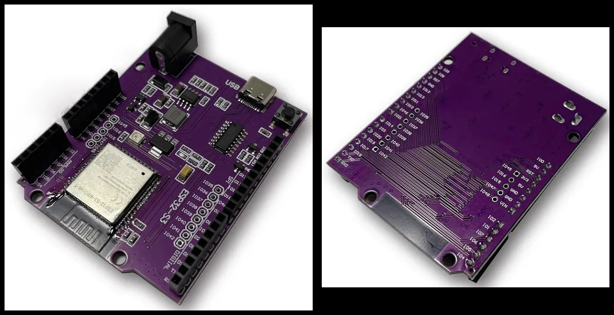
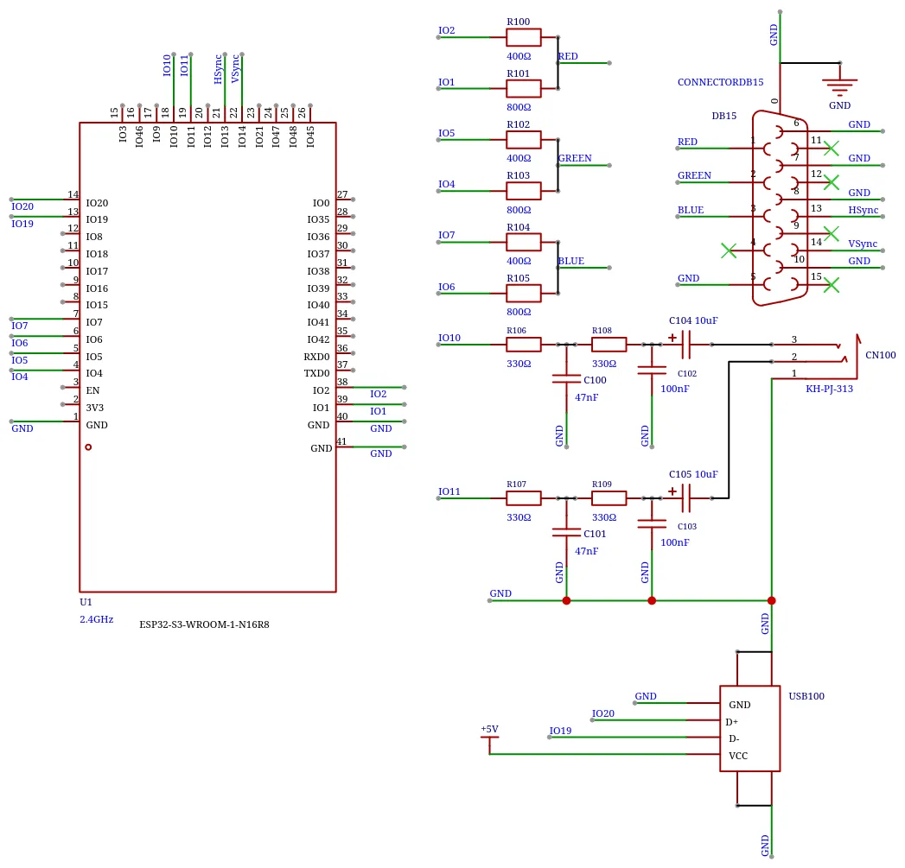
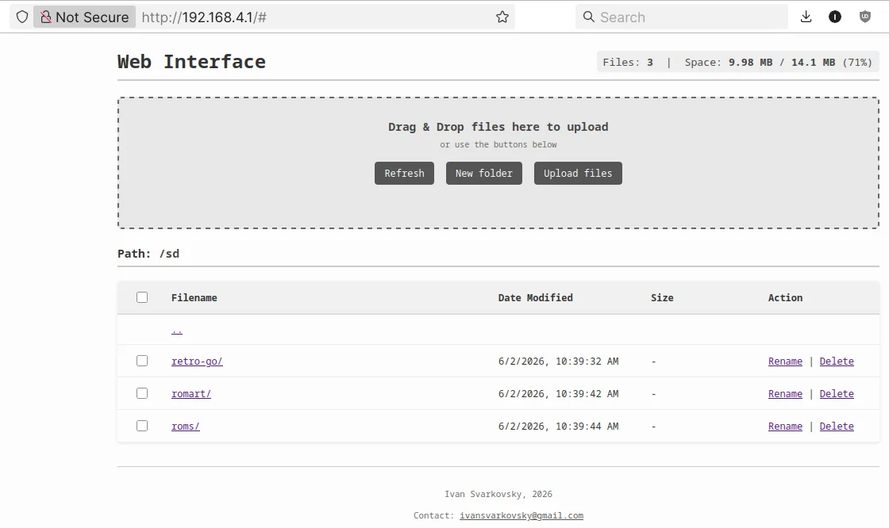
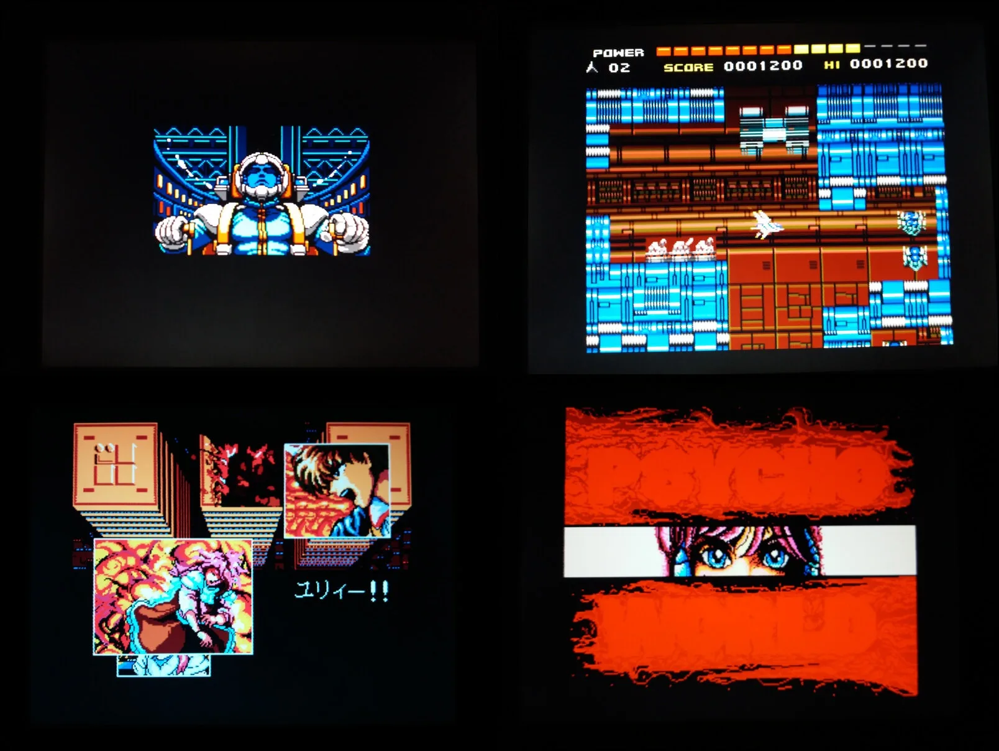
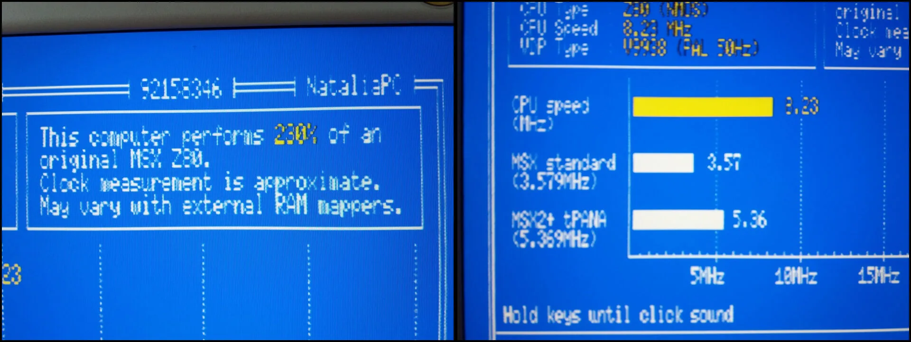
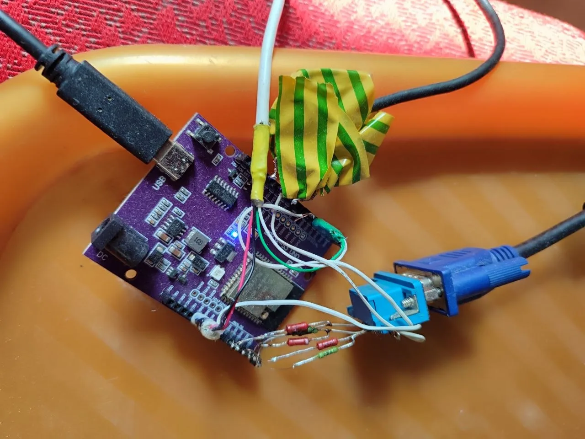
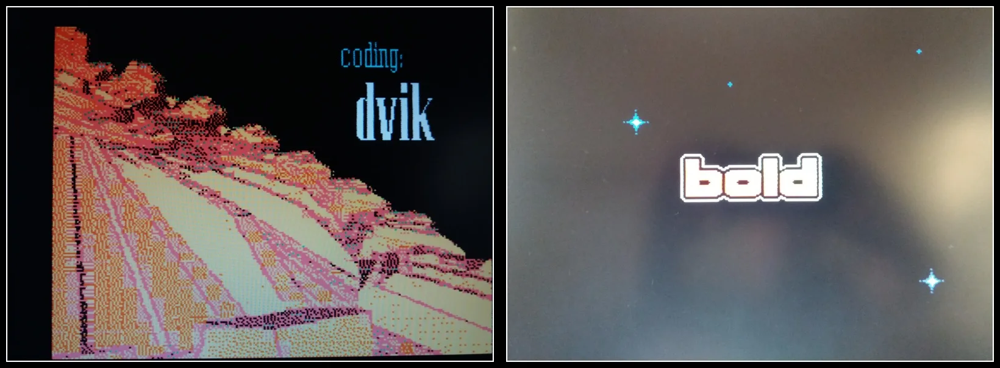
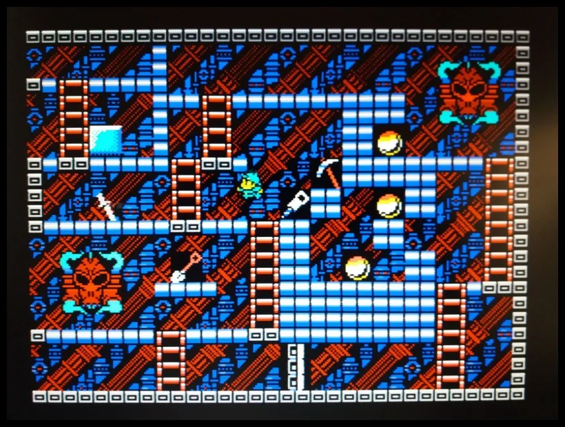

<sub>*The most up-to-date version is always in the source code on the `main` branch.*</sub>

---

<div align="center">

[🇺🇸 EN](#retro-go-s3-msx-pc) | [🇺🇦 UA](#retro-go-s3-msx-pc-українська-версія) | [🇩🇪 DE](#retro-go-s3-msx-pc-deutsch) | [🇯🇵 JP](#retro-go-s3-msx-pc-日本語)

# S3-MSX-PC

### Deeply optimized MSX emulation on ESP32-S3 with VGA output

</div>

---

<div align="center">
  
[](https://www.cnx-software.com/2026/06/11/bare-metal-msx2-emulator-for-esp32-s3-offers-custom-lcd_cam-vga-implementation-z80-optimizations/)  [](https://hackaday.com/2026/06/12/deeply-optimized-msx-emulation-on-esp32-s3-with-vga-output/)

</div>

---

<a id="retro-go-s3-msx-pc"></a>
<h1 align="right">🇺🇸</h1>

> 
>
> **Hello, I'm Ivan Svarkovsky.** I'm not a professional programmer, but I'm interested in microcontrollers, and this is a hobby from which I derive tremendous pleasure.
>
> Having acquired a new development board, I rushed to master it as quickly as possible, and this is what came out of it. I never had my own MSX computer, but as a child, I played several times with friends on an MSX hardware clone manufactured by the Korean corporation Daewoo.
>
> Essentially, I've created a deeply reworked version that can certainly bring joy and fun, offering a chance to explore the era of these computers and, in part, Japanese culture. I hope you find it interesting.
> <br clear="left"/>

---

## What Is This?

Imagine a full-fledged home computer from the 80s that fits in the palm of your hand.

This project is an **MSX (Machines with Software eXchangeability) emulator** running on a single ESP32-S3 microcontroller. It's an attempt to recreate the experience of using a real retro PC: output to a big VGA monitor, a full-sized USB keyboard, and *that sound* from your childhood.

<table align="center" style="border: none; border-collapse: collapse;">
  <tr style="border: none;">
    <td style="border: none; padding: 10px; width: 50%;">
      <video src="https://github.com/user-attachments/assets/eeb3ee37-35a4-4a88-b82f-4b3e52c0a006" autoplay loop muted playsinline width="100%"></video>
    </td>
    <td style="border: none; padding: 10px; width: 50%;">
      <video src="https://github.com/user-attachments/assets/17e0b7a4-3b22-4ee4-a0d4-344c59e6b3fe" autoplay loop muted playsinline width="100%"></video>
    </td>
  </tr>
</table>

## What Can You Do With It?

<table align="center" style="border: none; border-collapse: collapse; width: 100%;">
  <tr style="border: none;">
    <td valign="top" style="border: none; padding-right: 20px; width: 60%;">
      <p>This tiny board becomes a full gaming and creative hub:</p>
      <ul>
        <li><strong>Play the classics:</strong> Run MSX2+ masterpieces like <em>Metal Gear</em>, <em>Gradius</em>, or <em>Ys</em> with smooth scrolling and vibrant graphics.</li>
        <li><strong>Immerse yourself:</strong> Connect a standard VGA monitor and USB keyboard. No tiny screens — just the real 80s scale.</li>
        <li><strong>Listen to chiptunes:</strong> A dedicated audio filter reveals the very same square waves of the PSG and complex FM melodies that defined the music of that era.</li>
        <li><strong>Manage over the air:</strong> Upload new games and save states directly through your browser via WiFi — no SD card swapping or reflashing.</li>
        <li><strong>Hotkeys for easy control:</strong> Take command with dedicated shortcuts (<em>Ctrl+Esc</em> for options, <em>Ctrl+F6/F7</em> for virtual drive management).</li>
        <li><strong>Smart disk auto-save:</strong> Protect your SD card from wear. The emulator writes sector changes back to the storage only upon a clean exit or reset.</li>
        <li><strong>High-capacity memory mapping:</strong> Emulate software requiring up to 4 MB of mapped RAM and 256 KB of VRAM for heavy tracker files or modern demos.</li>
        <li><strong>Z80 dynamic speed scaling:</strong> Toggle the "Smart Turbo" mode to run computational-heavy tasks at 2x rate without breaking screen or I/O port timings.</li>
        <li><strong>SRAM & instant save states:</strong> Save and restore your exact gameplay progress frames in real-time, backed by zero-heap streaming compression.</li>
        <li><strong>VGM tracker music:</strong> Listen to complex PSG, SCC, and OPLL multi-channel music tracker files with hardware-accurate mix levels.</li>
      </ul>
    </td>
    <td valign="top" style="border: none; width: 40%;">
      <video src="https://github.com/user-attachments/assets/447fe28d-402c-42de-95f1-eff2285d353b" autoplay loop muted playsinline width="100%"></video>
    </td>
  </tr>
</table>

## How It Works (Simple Language)

We didn't use off-the-shelf solutions. The system is built from carefully chosen components:

- **Brain (ESP32-S3):** A powerful dual-core processor. One core handles the game logic, while the other draws the picture and generates sound.
- **Sight (VGA R-2R):** Instead of a dedicated video chip, we use a clever resistor network. It converts digital zeros and ones into an analog signal that any old monitor understands.
- **Hearing (PDM Filter):** To make the sound sing rather than squeak, we use Sigma-Delta modulation with a multi-stage filter. Clean audio — without bulky chips.
- **Hands (USB Host):** The built-in USB port lets you plug in any modern keyboard — just like a regular PC.

## Who Is This For?

- **The nostalgic:** Those who want to remember when a computer was a window to a new world.
- **Geeks and engineers:** Those who love DIY hardware, soldering resistors, and optimizing code to squeeze every drop of performance from silicon.
- **Explorers:** Those curious about how 40-year-old electronics worked — implemented on 2026 technology.

**Welcome to a world where a few megabytes of memory become an entire universe of entertainment!**

<div align="center">
  
</div>

---

## Quick Start

### What You'll Need

- **Development board:** ESP32-S3-WROOM-1-N16R8 (recommended). [Flash: 16 MB (Quad SPI), PSRAM: 8 MB (Octal SPI)]. Other S3 boards may work, but this one is tested.



### Minimalist Hardware Setup

We'll build a working circuit without extra chips. You'll need:

| Component | Quantity | Purpose |
|-----------|----------|---------|
| Resistors (400 Ω, 1%) | 3 pcs | VGA R-2R (high bits) |
| Resistors (800 Ω, 1%) | 3 pcs | VGA R-2R (low bits) |
| Resistors (330–400 Ω) | 4 pcs | PDM audio filter |
| Capacitors (22–40 nF) | 2 pcs | PDM audio filter |
| Capacitors (47–100 nF) | 2 pcs | PDM audio filter |
| Capacitor (1–10 µF, electrolytic) | 2 pcs | DC blocking (audio out) |
| VGA connector | 1 pc | DB15 female |
| USB-A connector (female) | 1 pc | Keyboard |
| ESP32-S3 board | 1 pc | The heart of the project |

### Power Supply

To power the board, you have two simple options:

- **USB Type-C:** Connect the board to any standard 5V USB power source using the Type-C port on the ESP32-S3 DevKit. This is the easiest method — just plug it into your computer, a phone charger, or a power bank.
- **External DC Power:** Use an external power supply rated at **6–9 V, 0.5–0.8 A** connected to the DC barrel jack (5.5 × 2.1 mm) on the board. This is useful if you want a standalone setup without a USB cable for power.

> **Note:** It is also possible to power the board from a lithium-ion battery, but we're keeping things simple and won't cover that here.

### Circuit


### Pinout

| Component | Signal | GPIO | Notes |
|-----------|--------|------|-------|
| **USB Host** | D+ | **GPIO 20** | USB-A connector |
| | D- | **GPIO 19** | USB-A connector |
| **VGA** | HSync | **GPIO 13** | Horizontal sync |
| | VSync | **GPIO 14** | Vertical sync |
| | R0 (Red LSB) | **GPIO 1** | R-2R ladder |
| | R1 (Red MSB) | **GPIO 2** | R-2R ladder |
| | G0 (Green LSB) | **GPIO 4** | R-2R ladder |
| | G1 (Green MSB) | **GPIO 5** | R-2R ladder |
| | B0 (Blue LSB) | **GPIO 6** | R-2R ladder |
| | B1 (Blue MSB) | **GPIO 7** | R-2R ladder |
| **Audio** | PDM Right | **GPIO 10** | Via RC filter |
| | PDM Left | **GPIO 11** | Via RC filter |
| **Common** | GND | **GND** | Shared ground |

### VGA R-2R Ladder (64 Colors)

**Goal:** Convert 6 digital GPIO pins into 3 analog signals (R, G, B) for a VGA monitor.

We use 2 pins per color channel, giving 4 brightness levels per color = 64 colors total.

**Schematic (per color, e.g., Red):**

```text
GPIO R1 ---[ 400 Ω ]---+---> Red Out (VGA Pin 1)
                        |
GPIO R0 ---[ 800 Ω ]---+
```

Repeat this circuit 3 times — for Red, Green, and Blue.

**Why 400 Ω and 800 Ω?**
- This ratio (1:2) is the "gold standard" for ESP32 (3.3 V). When combined with the monitor's 75 Ω input impedance, the output is exactly 0.7 V — the VGA standard.
- **Use 1% tolerance resistors.** 5% resistors cause uneven brightness steps and dirty gradients.
- **SMD (0805/0603) or metal-film.** Never use wire-wound resistors — they are inductive coils that destroy high-frequency video signals.

### PDM Audio Filter (2nd Order)

**Goal:** Smooth the high-frequency PDM signal into clean analog audio, removing noise.

**Stereo schematic (one channel):**

```text
GPIO 10 ---[ R1: 400Ω ]---o---[ R2: 400Ω ]---o---[ C_block: 1–10 µF ]---> Audio Out
                          |                    |
                          [ C1: 40 nF ]        [ C2: 100 nF ]
                          |                    |
GND ----------------------+--------------------+
```

- Repeat for GPIO 11 (left channel).
- **C_block (DC blocking capacitor):** Use an electrolytic or tantalum capacitor, 1–10 µF.
  - **Plus (+)** → circuit side (after R2).
  - **Minus (-)** → output (headphones/amplifier).
  - Too small a value cuts bass; **10 µF is ideal for full, deep sound.**

### USB Host Wiring

```text
        +------------------+
        |                  |
  VBUS (5V) ---+--- VCC (5V)
        |      |
  D- (GPIO 19) ----- D-
        |      |
  D+ (GPIO 20) ----- D+
        |      |
  GND --------+--- GND
```

> **Important:** USB Host on S3 requires 5 V on VBUS. Do not connect VBUS to 3.3 V — use the board's 5 V pin. The internal LDO handles the logic level conversion.

### Assembly Steps

1. **Build the VGA R-2R circuit** (6 resistors) and connect to GPIO 1–6, 13, 14.
2. **Build two PDM RC filters** (4 resistors, 4 capacitors, 2 electrolytic caps) and connect to GPIO 10 and GPIO 11.
3. **Connect the USB-A connector** to GPIO 19 and GPIO 20.
4. **Flash the firmware** to your ESP32-S3 (see below).
5. **Enjoy MSX2+** on a VGA monitor with a keyboard and clean stereo sound.

**This setup is the ideal balance** between minimalism (no extra chips) and functionality (VGA, USB, PDM stereo).

### Flashing the Firmware

You have two options to get the software onto your board:

#### Option 1: Pre-built Release Image (Recommended for Beginners)

1. Download the latest release archive from the [Releases page](https://github.com/your-repo/releases).
2. Extract the file `full_dump_1.0.3-msx-pc_clean_and_clear.bin`.
   - *Verify integrity:* `md5sum` should be `00d8b743f48cbb43a41bb2baf62dac2e`.
3. Flash it using `esptool.py` with a single command:

```bash
esptool.py -p /dev/ttyUSB0 -b 460800 write_flash 0x0 full_dump_1.0.3-msx-pc_clean_and_clear.bin
```

This writes the entire contents of the file back to the flash starting at address `0x0`.

#### Option 2: Building from Source

If you want to compile the firmware yourself:

- **Toolchain:** [esp-idf v5.4.4](https://github.com/espressif/esp-idf/) — use exactly this version. It has been thoroughly tested and later versions may introduce breaking changes.
- **Recommended download:** Use the [archive with submodules included](https://dl.espressif.com/github_assets/espressif/esp-idf/releases/download/v5.4.4/esp-idf-v5.4.4.zip) to avoid git submodule issues.
- For detailed build instructions, expand the **Technical Deep Dive** section below.

### Powering On & First Boot

1. **Power the board** via USB Type-C or the DC barrel jack (5.5 × 2.1 mm, 6–9 V).
2. Once booted, **enable the WiFi access point**:
   - Press **Left Ctrl + ESC** to open the menu.
   - Navigate to **Options → Wi-Fi Options → Wi-Fi Enable [On]** and **Wi-Fi Access Point [Yes]**.
3. On your laptop, desktop, or phone, scan for Wi-Fi networks. Connect to **retro-go** with the password **retro-go**.
4. Open a browser, **disable any VPNs or anonymizers**, and go to **http://192.168.4.1**.



### Required Files

**The emulator does not include copyrighted system ROMs.**  
You must supply your own BIOS files obtained from your original MSX hardware 
or through other means permitted by law in your jurisdiction.

Create the following directory structure via the web interface:

```
/sd/retro-go/bios/msx/
```

Place these required BIOS files in that directory:

| File | MD5 Checksum |
|------|-------------|
| `MSX.ROM` | `aa95aea2563cd5ec0a0919b44cc17d47` |
| `MSX2.ROM` | `ec3a01c91f24fbddcbcab0ad301bc9ef` |
| `MSX2EXT.ROM` | `2183c2aff17cf4297bdb496de78c2e8a` |
| `MSX2P.ROM` | `6d8c0ca64e726c82a4b726e9b01cdf1e` |
| `MSX2PEXT.ROM` | `7c8243c71d8f143b2531f01afa6a05dc` |
| `FMPAC.ROM` | `6f69cc8b5ed761b03afd78000dfb0e19` |
| `DISK.ROM` | `80dcd1ad1a4cf65d64b7ba10504e8190` |
| `MSXDOS2.ROM` | `6418d091cd6907bbcf940324339e43bb` |

> **Optional:** `PAINTER.ROM` (Yamaha Painter) and `KANJI.ROM` (Kanji Font) are not required for most games.

> **Note:** MD5 values are provided for integrity verification only.  
> The project authors do not distribute these files and cannot assist in acquiring them.

### Games & Applications

Place your ROMs, applications, and disk images in:

```
/sd/roms/msx/
```

Create this directory via the web interface if it doesn't exist. The launcher will automatically scan this folder for supported files.

---



---

### Hotkeys

| Shortcut | Action |
|----------|--------|
| **Ctrl + Esc** | Open menu |
| **Arrow keys** | Navigate menus |
| **Ctrl + F6** | Insert disk in Drive A |
| **Ctrl + F7** | Insert disk in Drive B |

---

### Advanced Settings & Disk Auto-Save System

To maintain system stability, the settings are organized based on whether they can be changed safely during gameplay:
*   **On-the-Fly Settings (In-Game Menu):** Adjustments that can be modified during active emulation (e.g., Audio Output, Input Mode and Turbo Mode) are located in the in-game options menu.
*   **Pre-Boot Settings (Launcher Menu):** Core hardware-level configurations that cannot be dynamically changed while the emulator is running (e.g., MSX Hardware Model) reside in the launcher menu and require a restart to apply.

> ⚠️ **Disclaimer:** While these experimental options are designed to respect emulated hardware behaviors, they are provided "as-is". Use them at your own discretion, as certain software configurations may experience compatibility issues.

#### Default Memory Allocation (RAM & VRAM)
By default, the emulator is configured with expanded memory limits:
*   `"-ram", "256"` (allocates **4 MB** of mapped RAM).
*   `"-vram", "16"` (allocates **256 KB** of VRAM).

This high-capacity memory profile is configured intentionally to support demanding modern demos, play back heavy or complex VGM (Video Game Music) tracker files, and allow extensive RAM disk utilization without encountering system memory constraints.

#### Hardware Configuration & Autofire
*   **MSX Model Selection:** You can select the emulated computer model (**MSX1**, **MSX2**, or **MSX2+**) directly in the Launcher settings prior to booting.
*   **Autofire Option:** Autofire can be toggled in the options. Please note that certain games or applications may fail to load or boot when Autofire is enabled. If you experience boot freezes, try disabling this option first. It is safe to test and will not cause physical harm to your hardware.

#### Smart Disk Auto-Save
To minimize SD card wear, the emulator implements a hardware-level **dirty flag** system. Writing changes back to your SD card occurs only when *all* of the following conditions are met simultaneously:
1.  **Disk Auto-Save** is turned on in the settings (`msx_disk_autosave == 1`).
2.  A disk is currently inserted (`DSKName[N] != NULL`).
3.  The disk data has actually been modified (`msx_disk_modified[N] == 1`).

> **Technical Detail:** The `msx_disk_modified` flag is triggered dynamically within `WrZ80()` and `OutZ80()` only upon detecting sector or track write commands addressed to the emulated Floppy Disk Controller (WD1793). If you are only reading data or listening to music, no write operations will occur.

##### Physical Saving Process:
*   **Loading to PSRAM:** When a disk (`.dsk`) is loaded, the emulator copies the entire file (standard MSX disks are exactly 720 KB / 737,280 bytes) into the ESP32's PSRAM.
*   **In-Memory Operations:** During gameplay or music playback, all write operations are performed exclusively within this 720 KB RAM buffer. The SD card is not accessed for writes during active emulation.
*   **Overwriting on Exit:** Upon exiting the emulator (via the menu) or resetting, the modified RAM buffer is written back to the SD card, replacing the original `.dsk` file.

##### Storage Efficiency:
*   **Fixed Size:** MSX disk images have a strictly fixed size (720 KB for standard double-sided, or 360 KB for single-sided). The file size remains constant and will never increase.
*   **In-Place Writes:** The saving mechanism overwrites the existing file directly without creating temporary clones (such as `game_temp.dsk`). This means auto-saving requires **0 bytes** of additional free space on your SD card.

> ⚠️ **Critical Warning on Storage Space:** While the disk auto-save mechanism writes in place and requires 0 bytes of extra space, creating save states (`.sta`) or standard SRAM saves (`.sav`) requires writing new files. If your SD card runs completely out of free space, the emulator will be unable to write these files. Consequently, save states will fail to write, leaving you with no data to load. Always ensure your SD card has at least a few megabytes of free space to guarantee reliable save operations.

#### Turbo Mode (Z80 Overclocking)
Turbo Mode dynamically scales the Z80 CPU calculation rate for computing tasks by exactly **2x** on the fly:
*   **MSX (3.58 MHz base):** Delivers processing performance equivalent to **~8.23 MHz** (measured on ESP32-S3 benchmark).

##### How it Mimics Real Hardware:
This software implementation mimics how classic hardware turbo modifications functioned:
*   **Panasonic MSX2+ (FS-A1WSX/WX):** These machines had a hardware switch to run at 5.37 MHz or 7.16 MHz but inserted wait states during VDP (video chip) access. This emulator behaves similarly in software by preserving normal emulated timings for I/O registers (`0xD3`/`0xDB`) and block instructions (`LDIR`, `OTIR`, etc.) while accelerating arithmetic instructions.

##### Practical Implications & Timing Compatibility:
*   **VDP-Polling Games:** Games that wait for VDP readiness via polling loops (`IN` + `JP`/`JR`) will run correctly without graphical corruption or flickering sprites, as port I/O maintains exact hardware timing.
*   **Tape/Cassette Loaders (Important Warning):** If an application or game loads via raw tape audio signals (by counting cycles with instructions like `DJNZ`), enabling Turbo Mode will scale the cycle count of these loops. The emulated system will perceive the incoming audio as playing twice as slow, causing the load to fail. **You must set `TurboMode = 0` (Off) when loading cassettes.**

##### ESP32-S3 Execution Efficiency:
The instruction-level check `if (TurboMode && LIKELY(...))` introduces a single memory read and branch inside the core execution loop (`NEXT_OP`). However, performance is preserved because:
1.  The `TurboMode` state variable is cached directly in the ESP32-S3's L1 Data Cache (D-Cache).
2.  The `LIKELY` compiler hint ensures the Xtensa LX7 pipeline correctly predicts branches, as more than 98% of executed instructions are standard CPU calculations rather than I/O port calls.




---


> **Want to dig deeper into the engineering?** Click below to expand the full technical documentation with code examples, disassembly analysis, and compilation metrics.

<details>
<summary><b>🔧 For those who want to dive in: Technical Deep Dive</b></summary>

<br>

This project goes beyond a standard port of Retro-Go. The memory access architecture, rendering pipeline, VDP and Z80 cores, along with the I/O subsystem, have been fundamentally redesigned. The objective was to create a tight symbiosis with the silicon topology of the ESP32-S3 (Xtensa LX7).

<div align="center">
  
  <br>
  <em>Yep, this is exactly what peak engineering looks like during the design and debugging phase.</em>
</div>

<br>

The result is a low-latency MSX 1/2/2+ firmware with native VGA output and studio-accurate audio emulation.

### Key Features

| Feature            | Specification                                               |
| ------------------ | ----------------------------------------------------------- |
| **Emulation Core** | fMSX 6.0 — Full MSX1 / MSX2 / MSX2+ support                 |
| **Video Output**   | VGA 640×480@60Hz, 16-bit parallel RGB via LCD_CAM           |
| **Color Depth**    | 64 colors (2 bits per channel: R, G, B)                     |
| **USB Host**       | Plug-and-play keyboards                                     |
| **Input Latency**  | ~2–4 ms (USB interrupt-driven, software debounce bypassed)  |
| **Audio**          | PDM Stereo with hardware underrun protection                |

### Why This Matters for ESP32-S3

The Xtensa LX7 has specific architectural traits that this project leverages:

*   **Large IRAM** — highly performant but limited (~128 KB available after system overhead). All execution hot paths are placed here.
*   **DRAM** — fast internal memory. Allocated for render buffers and lookup tables.
*   **PSRAM** — slow external memory. Strictly avoided in all hot loops.
*   **Windowed Register File** — 32-bit registers utilized for efficient variable caching.
*   **LCD_CAM** — a hardware peripheral with built-in byte-swap and DMA capabilities.
*   **Xtensa Pipeline** — highly sensitive to indirect branches and cache misses.

All optimizations target PSRAM traffic reduction, indirect branch elimination, and maximum IRAM/DRAM utilization.

### 1. VDP (V9938/V9958) & Rendering Engine Optimization

The original fMSX rendering engine was heavily memory-bound. The rendering pipeline was restructured to bypass these limitations:

#### Register-Cached VRAM & 32-bit Bursts

```c
IRAM_ATTR void RefreshLine8(register byte Y) {
    ...
    for (X = 0; X < 32; X++, T += 8, R += 8, P += 8) {
        uint32_t t_low  = *(uint32_t*)T;      /* 32-bit read */
        uint32_t t_high = *(uint32_t*)(T + 4);
        uint32_t r_val  = *(uint32_t*)R;

        if (LIKELY((r_val | (r_val >> 32)) == 0)) {
            /* fast path: no sprites */
        } else {
            /* sprite overlay */
        }
    }
}
```

Xtensa prefers 32-bit aligned accesses. By fetching 32-bit aligned words instead of individual bytes, memory bus transactions are reduced by a factor of four.

#### LUT Fusion & SC5_LUT

```c
static uint32_t SC5_LUT[256] __attribute__((section(".dram0.data")));
static pixel SprPal[16];

static inline void SyncPalette(void) {
    for (int i = 0; i < 256; i++) {
        uint32_t c_left = XPal[i >> 4];
        uint32_t c_right = XPal[i & 0x0F];
        SC5_LUT[i] = c_left | (c_right << 16);
    }
    /* ... SprPal */
}
```

SCREEN 5 is the most common display mode. Palette lookup occurs millions of times per second. Pinning these structures to DRAM eliminates Flash cache misses completely.

#### Indirect Branch Elimination (VDP Command Engine)

```c
static uint8_t ActiveVdpEngine = 0;

IRAM_ATTR static void RunActiveEngine(void) {
    switch (ActiveVdpEngine) {           /* Direct switch, no function pointers */
        case CM_SRCH: SrchEngine(); break;
        case CM_LINE: LineEngine(); break;
        case CM_LMMM: LmmmEngine(); break;
        case CM_HMMM: HmmmEngine(); break;
        /* ... 10 commands total */
    }
}
```

The original code relied on a function pointer (`VdpEngine`). Each call resulted in an indirect branch, causing pipeline flushes on Xtensa. A flat switch over a `uint8_t` state variable provides predictable branching. All engines reside in `IRAM_ATTR`.

#### Branchless YJK Color Decoding

```c
static const uint8_t clip_RG[95] = { ... };
static const uint8_t clip_B[345] = { ... };

INLINE pixel YJKColor(int Y, int J, int K, int B_offset) {
    int R = clip_RG[Y + J + 32];
    int G = clip_RG[Y + K + 32];
    int B = clip_B[(((Y << 2) + Y + B_offset) >> 2) + 93];
    return BPal[(R & 0x1C) | ((G & 0x1C) << 3) | (B >> 3)];
}
```

Conditional branches were removed from one of the most CPU-intensive paths in MSX2+ rendering by precomputing clipping boundaries into lookup arrays.

#### Unaligned Write Protection

```c
/* Safe 32-bit pixel assignment — prevents unaligned exceptions on ESP32-S3 */
#define WRITE_P(idx, val)                                                      \
    do {                                                                       \
        uint32_t _v = (val);                                                   \
        P[(idx)] = _v;                                                         \
        P[(idx) + 1] = _v >> 16;                                               \
    } while (0)
```

The Xtensa LX7 throws a hardware exception on unaligned memory access. This macro guarantees alignment and executes faster than two independent 16-bit assignments.

### 2. Video Pipeline & Custom VGA Driver

#### DRAM Render Buffer

```c
static uint16_t DRAM_ATTR __attribute__((aligned(64))) 
    sram_render_buffer[MAX_CHUNK_PIXELS];

static void lcd_send_buffer(uint16_t *buffer, size_t length) {
    for (int i = 0; i < lines; i++) {
        uint16_t *dst = &vga_fb[(current_y + i) * VGA_WIDTH + window_x];
        memcpy(dst, &buffer[i * window_w], line_bytes);
        /* LCD_CAM handles byte-swap in hardware */
    }
}
```

#### Hardware Configuration

```c
/* Initialization */
LCD_CAM.lcd_user.lcd_byte_order = 1;   /* Hardware byte-swap, 0 CPU cycles */
```

*   `sram_render_buffer` is placed in DRAM to ensure zero-wait-state CPU writes.
*   `vga_fb` is placed in PSRAM to be sequentially read by the DMA controller.
*   MSX palettes are pre-shifted during initialization to directly match the physical R-2R resistor ladder pins (R-13/12, G-8/7, B-3/2). Mathematical C_RGB conversion during rendering is bypassed entirely.
*   Hardware double-buffering is implemented via the ESP-IDF driver, utilizing VSYNC-locked page flipping.
*   For 256px games, scaling utilizes the `S64I` instruction: the CPU reads 32 bits and writes 64 bits per bus cycle (processing 4 pixels at once).

### 3. Z80 Core

#### Threaded Dispatch (Computed Goto) + Register Caching

```c
// Z80.c
static const void *const op_table[256] Z80_TABLE_ATTR = {
    &&op_NOP, &&op_LD_BC_WORD, &&op_LD_xBC_A, /* ... */ &&op_RST38
};

#define NEXT_OP() \
    do { \
        if (UNLIKELY(ICount <= 0)) goto check_ints; \
        I = OpZ80(PC++); \
        ICount -= Cycles[I]; \
        INCR(1); \
        goto *op_table[I];          /* Computed Goto */ \
    } while(0)

word __attribute__((section(".iram1.text"))) RunZ80(register Z80 * restrict R) {
    register uint32_t PC = R->PC.W;      /* Cached in physical register */
    register int ICount = R->ICount;

    NEXT_OP();

    /* All opcode handlers use the local PC variable */

check_ints:
    R->PC.W = PC;        /* State synchronized only on interrupts */
    R->ICount = ICount;
    /* ... */
}
```

The original `switch(opcode)` dispatcher resulted in unpredictable branches and pipeline stalls. Computed Goto converts dispatching into a single, predictable jump. Emulated PC and ICount are mapped to physical 32-bit registers, eliminating repeated memory access during instruction decoding.

#### Software Line Cache (1 KB)

```c
__attribute__((section(".data"))) static uint8_t ROMLineCache[16][64];
__attribute__((section(".data"))) static uint32_t ROMLineTag[16];
```

To mitigate slow SPI Flash access, a direct-mapped cache buffers 64-byte ROM lines (0x4000-0x7FFF). Cache hits resolve in 1 cycle. Cache misses perform an unrolled `uint32_t` block copy.

**IRAM Pinning:** Core execution paths (`RunZ80`, prefix decoders, VDP engines) are locked in `.iram1.text` to guarantee zero-latency instruction fetching.

### 4. Dual Audio Engine & Stereo Routing

#### Okazaki Cycle-Accurate Engines

```c
/* emu2413.c — OPLL lookup tables mapped to DRAM */
static DRAM_ATTR e_uint32 dphaseARTable[16][16];
static DRAM_ATTR e_uint32 dphaseDRTable[16][16];
static DRAM_ATTR e_int16 DB2LIN_TABLE[(DB_MUTE + DB_MUTE)*2];
```

Integrated cycle-accurate engines by Mitsutaka Okazaki: `emu2149` (PSG with DC Blocker), `emu2413` (OPLL), and `emu2212` (SCC). To prevent complex OPLL mathematical operations from stalling the CPU, 11.4 KB of lookup tables were relocated from PSRAM into zero-wait-state DRAM.

**Hardware Stereo Routing:**
*   PSG → Center
*   SCC → Left channel
*   OPLL → Right channel
*   All mixed channels pass through a fast integer-based SoftClip limiter.

### 5. HID

**USB HID:** The USB Host task operates in an event-driven mode (`portMAX_DELAY`), consuming 0% CPU time while idle. Input events trigger hardware interrupts, bypassing the software debounce filters required for physical buttons. This achieves a sub-5ms input latency.

### Compilation Analysis & Binary Metrics

#### Build Artifacts (Release, esp-idf v5.4.4)

| Metric | Launcher | fMSX Core |
|--------|----------|-----------|
| **Flash binary (.bin)** | 835 KB | 749 KB |
| **IRAM (.iram0.text)** | — | 178,179 bytes (~174 KB) |
| **DRAM data (.dram0.data)** | — | 37,504 bytes |
| **DRAM BSS (.dram0.bss)** | — | 94,176 bytes |
| **Flash text (.flash.text)** | — | 428,626 bytes (~418 KB) |
| **libretro-go.a** | — | 2,177 KB |
| **libfmsx.a** | — | 1,770 KB |

#### Key Hot-Path Placement

All performance-critical functions are locked in IRAM (zero-wait-state instruction fetch):

| Function | Size | Location |
|----------|------|----------|
| `RunZ80` | 31,826 bytes (~31 KB) | IRAM |
| `RunActiveEngine` (VDP) | 19,998 bytes (~19.5 KB) | IRAM |
| `CodesDD` (prefix handler) | 11,378 bytes | IRAM |
| `CodesFD` (prefix handler) | 11,367 bytes | IRAM |
| `CodesED` (prefix handler) | 2,830 bytes | IRAM |

#### Computed Goto Verification

Prefix handlers (CB/DD/ED/FD) are **not inlined** into `RunZ80` — they are called via `call0`/`call8`, keeping `RunZ80` itself compact:

```asm
; Disassembly confirms indirect calls through op_table[]
4038ad11:  call0  4038db34 <CodesFD>     ; FD prefix
4038c606:  call8  4038c944 <CodesED>     ; ED prefix
403a216a:  call0  4039233c <CodesDD>     ; DD prefix
403a229a:  call0  4039246c <CodesDD>     ; DD prefix (second path)
```

The `constprop` suffix (e.g., `CodesDDconstprop0`) confirms LTO has propagated constants into these handlers — reducing memory loads per opcode.

#### Main Dispatch Loop (Verified from Disassembly)

```asm
40384cf0 <RunZ80>:
    entry   a1, 48              ; Function prologue
    ; PC cached in a7 (physical register)
    l16ui   a7, a2, 12          ; a7 = R->PC.W (16-bit load)
    l32i    a3, a2, 32          ; a3 = R->ICount
    ; ...
    ; Opcode fetch + dispatch
    call8   RdZ80               ; I = OpZ80(PC++)
    l8ui    a9, a2, 26          ; Load flags
    l32r    a4, Cycles           ; Cycles table pointer
    l32r    a5, op_table0        ; Opcode jump table
    addx4   a10, a10, a5        ; op_table[I]
    l32i    a9, a10, 0          ; Load target address
    sub     a3, a3, a8          ; ICount -= Cycles[I]
    jx      a9                  ; goto *op_table[I]  ← SINGLE PREDICTABLE JUMP
```

**Key observations from disassembly:**
*   `PC` lives in register `a7` throughout the entire `RunZ80` — no stack spills.
*   `ICount` lives in register `a3` — updated in-place.
*   Dispatch is `jx a9` — a single register-indirect jump, perfectly predicted by Xtensa branch predictor.
*   No `switch`/`case` overhead visible — the jump table is a flat array of 256 label addresses.

#### WiFi Stack Purging

Standard ESP-IDF WiFi stack occupies significant flash space. The following functions were identified as unnecessary for this project:

| Function | Size | Why Removed |
|----------|------|-------------|
| `ieee80211_sta_new_state` | 3,085 bytes | STA state machine |
| `scan_parse_beacon` | 2,856 bytes | Beacon parsing |
| `ieee80211_parse_rsn` | 1,908 bytes | RSN/WPA2 parsing |
| `ieee80211_parse_beacon` | 1,206 bytes | Full beacon parser |
| `ieee80211_assoc_req_construct` | 1,061 bytes | Association request |
| `ieee80211_update_channel` | 960 bytes | Channel management |
| ... and ~80 more functions | ~40 KB total | Full WiFi stack |

**Total WiFi stack removed: ~40 KB of flash** — reclaimed for emulator code and future features.

#### Stack Protector Verification

```text
Z80.c.obj: 0 stack protector calls
libfmsx.a: 0 stack protector calls
```

No stack canaries in hot paths — zero overhead from `-fstack-protector`.

#### Binary Size Efficiency

Despite adding three Okazaki audio engines (`emu2149` + `emu2413` + `emu2212`), a custom VGA driver, and a Z80 software line cache, the total fMSX binary is only **749 KB**. For comparison, this is smaller than many unoptimized ESP32 firmware builds that include the full WiFi/BLE stack.

### Results

*   Significantly reduced cache misses across VDP and Z80 execution paths.
*   Stable 60 fps maintained in heavy MSX2 titles (SCREEN 5/8/12).
*   Highly responsive USB input (< 5 ms latency).
*   Audio synchronization holds steady without stuttering during simultaneous PSG + SCC + OPLL processing.

### Hardware Setup

| Component | Specification                                         |
| --------- | ----------------------------------------------------- |
| **Board** | ESP32-S3-WROOM-1 (N16R8)                              |
| **Video** | VGA 640×480 via 16-bit R-2R DAC                       |
| **Audio** | PDM Stereo output (external DAC)                      |
| **Input** | USB Port (Keyboard auto-detect)                       |

### Building
```bash
# Clone the structure (without files)
git clone --filter=blob:none --no-checkout https://github.com/Svarkovsky/s3-msx-pc.git
cd s3-msx-pc

# Enable sparse checkout mode
git sparse-checkout init --no-cone

# Set rules 
git sparse-checkout set '/*' '!img/' 

# Fetch the files
git checkout
```

**Toolchain:** `esp-idf v5.4.4`

#### Debug Build (Development)
```bash
# Clean
rm -rf launcher/build launcher/sdkconfig fmsx/build fmsx/sdkconfig
python3 rg_tool.py --target s3-msx-pc clean

# Build
python3 rg_tool.py --target s3-msx-pc build launcher fmsx

# Flash
esptool.py -p /dev/ttyUSB0 erase_flash
cd launcher && idf.py -p /dev/ttyUSB0 flash && cd ..
python3 rg_tool.py --target s3-msx-pc --port /dev/ttyUSB0 flash fmsx

# Monitor
cd launcher && idf.py -p /dev/ttyUSB0 monitor
```

#### Release Build (Production)
```bash
# Launcher
rm -rf launcher/build launcher/sdkconfig
python3 rg_tool.py --target s3-msx-pc release launcher
cd launcher && idf.py -p /dev/ttyUSB0 flash && cd ..

# fMSX Core
rm -rf fmsx/build fmsx/sdkconfig
python3 rg_tool.py --target s3-msx-pc release fmsx
python3 rg_tool.py --target s3-msx-pc --port /dev/ttyUSB0 flash fmsx
```

## For those who find this insufficient and want more...

If the above summary has merely piqued your interest and you'd like to explore the remaining 60% of architectural madness, here you go:

[MSX ESP32-S3 Optimization Notes](notes/OPTIMIZATIONS.md)

And please don't tell me you already knew all this! ;)

</details>

---

### Credits & License

This project is a combined work with mixed licensing. **As a whole, this project is for NON-COMMERCIAL, PERSONAL USE ONLY.**

| Component | License | Author |
|-----------|---------|--------|
| **fMSX Core** | Proprietary (Non-commercial) | Marat Fayzullin |
| **Retro-Go Framework** | GPL-3.0 | ducalex |
| **S3-MSX-PC Adaptations** | Provided for personal/educational use | Ivan Svarkovsky |
| **DS-LZ Compression** | CC BY-NC-SA 4.0 | Ivan Svarkovsky |
| *Integrated in State.h; standalone library: [ds-lz.h](https://github.com/Svarkovsky/dslz)* |

**Commercial use of the fMSX core requires explicit written permission from Marat Fayzullin.**

> **Note on Licensing Conflict:** This is a "Source Available" hobby project, not an OSI-approved open source release. The non-commercial restriction from the fMSX core propagates to the entire distribution. This creates a technical licensing conflict with the GPL-3.0 retro-go framework, as the components are statically linked. This repository exists strictly for educational purposes and preservation of computing history.


---

> This is just a small part of what has been implemented and what I'd like to share. Don't hesitate to ask questions.
>
> Thank you for your attention.
>
> — Ivan Svarkovsky

--- 

## 💙

If you find this project useful, consider supporting its development:

**[→ Donate & Support](https://svarkovsky.github.io/donate/?lang=en)**

Your contribution helps keep the project maintained and improved. Thank you!

---

<br>
<div align="center">
  <a href="#retro-go-s3-msx-pc">⬆️ Back to Top</a>
</div>
<br>

---

<a id="retro-go-s3-msx-pc-українська-версія"></a>
<h1 align="right">🇺🇦</h1>

> **Привіт, я Іван Сварковський.** Я не професійний програміст, але мені цікаві мікроконтролери, і це хобі, від якого я отримую величезне задоволення.
>
> З придбанням нової для мене плати розробки я поспішив швидше її освоїти, і ось що з цього вийшло. У мене ніколи не було свого комп'ютера MSX, але в дитинстві я кілька разів грав із товаришами на апаратному клоні MSX виробництва корейської корпорації Daewoo.
>
> Власне, я зробив глибоко перероблену версію, яка цілком може подарувати радість і веселощі, дати можливість ознайомитися з епохою цих комп'ютерів і частково з японською культурою. Сподіваюся, вам буде цікаво.

---

## Що це таке?

Уявіть повноцінний домашній комп'ютер з 80-х, який поміщається на долоні.

Цей проєкт — **емулятор MSX (Machines with Software eXchangeability)**, що працює на одному мікроконтролері ESP32-S3. Це спроба відтворити досвід використання справжнього ретро-ПК: вивід на великий VGA-монітор, повнорозмірну USB-клавіатуру та *той самий звук* з дитинства.

## Що можна робити?

Ця крихітна плата перетворюється на повноцінний ігровий та творчий центр:

- **Грайте в класику:** Запускайте шедеври епохи MSX2+, такі як *Metal Gear*, *Gradius* або *Ys*, з плавним скролінгом та яскравою графікою.
- **Пориньте в атмосферу:** Підключіть звичайний VGA-монітор та USB-клавіатуру. Жодних маленьких екранчиків — тільки справжній масштаб 80-х.
- **Слухайте чіптюни:** Спеціальний аудіо-фільтр розкриває ті самі квадратні хвилі PSG та складні FM-мелодії, що визначали музику тієї епохи.
- **Керуйте через повітря:** Завантажуйте нові ігри та збереження прямо через браузер по WiFi — без заміни SD-карт або перепрошивки.

## Як це працює (простою мовою)

Ми не використовували готові рішення. Система побудована з ретельно підібраних компонентів:

- **Мозок (ESP32-S3):** Потужний двоядерний процесор. Одне ядро обробляє логіку гри, інше — малює картинку та генерує звук.
- **Зір (VGA R-2R):** Замість окремого відеочіпа ми використовуємо розумну резисторну мережу. Вона перетворює цифрові нулі та одиниці в аналоговий сигнал, який розуміє будь-який старий монітор.
- **Слух (PDM-фільтр):** Щоб звук співав, а не пищав, ми використовуємо Sigma-Delta модуляцію з багатоступеневим фільтром. Чистий звук — без громіздких мікросхем.
- **Руки (USB Host):** Вбудований USB-порт дозволяє підключити будь-яку сучасну клавіатуру — як до звичайного ПК.

## Для кого цей проєкт?

- **Для ностальгуючих:** Тих, хто хоче згадати, як це було, коли комп'ютер був вікном у новий світ.
- **Для гіків та інженерів:** Тих, хто любить DIY-залізо, паяти резистори та оптимізувати код, щоб вичавити максимум з кремнію.
- **Для дослідників:** Тих, кому цікаво, як працювала електроніка 40-річної давнини — реалізована на технологіях 2026 року.

**Ласкаво просимо у світ, де кілька мегабайт пам'яті перетворюються на цілий всесвіт розваг!**

---

## Швидкий старт

### Що вам знадобиться

- **Плата розробки:** ESP32-S3-WROOM-1-N16R8 (рекомендовано). [Flash: 16 MB (Quad SPI), PSRAM: 8 MB (Octal SPI)]. Інші плати S3 можуть працювати, але ця перевірена.


### Мінімалістичне налаштування

Зберемо робочу схему без зайвих чипів. Вам знадобиться:

| Компонент | Кількість | Призначення |
|-----------|----------|-------------|
| Резистори (400 Ом, 1%) | 3 шт. | VGA R-2R (старші біти) |
| Резистори (800 Ом, 1%) | 3 шт. | VGA R-2R (молодші біти) |
| Резистори (330–400 Ом) | 4 шт. | PDM аудіо-фільтр |
| Конденсатори (22–40 нФ) | 2 шт. | PDM аудіо-фільтр |
| Конденсатори (47–100 нФ) | 2 шт. | PDM аудіо-фільтр |
| Конденсатор (1–10 мкФ, електролітичний) | 2 шт. | DC-блокування (вихід звуку) |
| VGA-роз'єм | 1 шт. | DB15 female |
| USB-A роз'єм (female) | 1 шт. | Клавіатура |
| Плата ESP32-S3 | 1 шт. | Серце проєкту |

### Живлення

Щоб заживити плату, у вас є два простих варіанти:

- **USB Type-C:** Підключіть плату до будь-якого стандартного USB-джерела живлення 5 В через порт Type-C на ESP32-S3 DevKit. Це найпростіший метод — просто увімкніть у комп'ютер, зарядний пристрій для телефону або повербанк.
- **Зовнішнє живлення:** Використовуйте зовнішній блок живлення з параметрами **6–9 В, 0.5–0.8 А**, підключений до гнізда живлення DC (5.5 × 2.1 мм) на платі. Це зручно, якщо ви хочете автономне налаштування без USB-кабеля для живлення.

> **Примітка:** Також можна живити плату від літій-іонного акумулятора, але ми йдемо найпростішим шляхом і не розглядатимемо цей варіант.

### Загальна схема


### Розпіновка

| Компонент | Сигнал | GPIO | Примітки |
|-----------|--------|------|-------|
| **USB Host** | D+ | **GPIO 20** | USB-A роз'єм |
| | D- | **GPIO 19** | USB-A роз'єм |
| **VGA** | HSync | **GPIO 13** | Горизонтальна синхронізація |
| | VSync | **GPIO 14** | Вертикальна синхронізація |
| | R0 (Red LSB) | **GPIO 1** | R-2R матриця |
| | R1 (Red MSB) | **GPIO 2** | R-2R матриця |
| | G0 (Green LSB) | **GPIO 4** | R-2R матриця |
| | G1 (Green MSB) | **GPIO 5** | R-2R матриця |
| | B0 (Blue LSB) | **GPIO 6** | R-2R матриця |
| | B1 (Blue MSB) | **GPIO 7** | R-2R матриця |
| **Аудіо** | PDM Правий | **GPIO 10** | Через RC-фільтр |
| | PDM Лівий | **GPIO 11** | Через RC-фільтр |
| **Загальне** | GND | **GND** | Спільна земля |

### VGA R-2R матриця (64 кольори)

**Мета:** Перетворити 6 цифрових пінів GPIO на 3 аналогові сигнали (R, G, B) для VGA-монітора.

Використовуємо 2 піни на колірний канал, що дає 4 рівні яскравості на колір = 64 кольори.

**Схема (на один колір, наприклад, Red):**

```text
GPIO R1 ---[ 400 Ом ]---+---> Red Out (VGA Pin 1)
                         |
GPIO R0 ---[ 800 Ом ]---+
```

Повторіть цю схему 3 рази — для Red, Green та Blue.

**Чому 400 Ом та 800 Ом?**
- Це співвідношення (1:2) — «золотий стандарт» для ESP32 (3.3 В). У поєднанні з вхідним опором монітора 75 Ом вихід становить рівно 0.7 В — стандарт VGA.
- **Використовуйте резистори з допуском 1%.** Резистори 5% спричиняють нерівномірні кроки яскравості та брудні градієнти.
- **SMD (0805/0603) або металоплівкові.** Ніколи не використовуйте дротові резистори — це індуктивні котушки, що знищують високочастотні відеосигнали.

### PDM аудіо-фільтр (2-го порядку)

**Мета:** Згладити високочастотний PDM-сигнал у чистий аналоговий звук, прибираючи шум.

**Стерео-схема (один канал):**

```text
GPIO 10 ---[ R1: 400Ω ]---o---[ R2: 400Ω ]---o---[ C_block: 1–10 мкФ ]---> Audio Out
                          |                    |
                          [ C1: 40 нФ ]        [ C2: 100 нФ ]
                          |                    |
GND ----------------------+--------------------+
```

- Повторіть для GPIO 11 (лівий канал).
- **C_block (конденсатор блокування постійного струму):** Використовуйте електролітичний або танталовий конденсатор, 1–10 мкФ.
  - **Плюс (+)** → до схеми (після R2).
  - **Мінус (-)** → до виходу (навушники/підсилювач).
  - Занадто мале значення обрізає баси; **10 мкФ — ідеально для повного, глибокого звуку.**

### Підключення USB Host

```text
        +------------------+
        |                  |
  VBUS (5V) ---+--- VCC (5V)
        |      |
  D- (GPIO 19) ----- D-
        |      |
  D+ (GPIO 20) ----- D+
        |      |
  GND --------+--- GND
```

> **Важливо:** USB Host на S3 потребує 5 В на VBUS. Не підключайте VBUS до 3.3 В — використовуйте пін 5 В на платі. Внутрішній LDO обробляє перетворення логічних рівнів.

### Кроки збірки

1. **Зберіть VGA R-2R схему** (6 резисторів) та підключіть до GPIO 1–6, 13, 14.
2. **Зберіть два PDM RC-фільтри** (4 резистори, 4 конденсатори, 2 електроліти) та підключіть до GPIO 10 та GPIO 11.
3. **Підключіть USB-A роз'єм** до GPIO 19 та GPIO 20.
4. **Прошийте прошивку** на ваш ESP32-S3 (див. нижче).
5. **Насолоджуйтесь MSX2+** на VGA-моніторі з клавіатурою та чистим стереозвуком.

**Це налаштування — ідеальний баланс** між мінімалізмом (без зайвих чипів) та функціональністю (VGA, USB, PDM стерео).

### Прошивка мікроконтролера

У вас є два варіанти встановлення програмного забезпечення на плату:

#### Варіант 1: Готовий образ релізу (Рекомендовано для початківців)

1. Завантажте останній архів релізу зі сторінки [Releases](https://github.com/your-repo/releases).
2. Розпакуйте файл `full_dump_1.0.3-msx-pc_clean_and_clear.bin`.
   - *Перевірка цілісності:* `md5sum` має бути `00d8b743f48cbb43a41bb2baf62dac2e`.
3. Прошийте його за допомогою `esptool.py` однією командою:

```bash
esptool.py -p /dev/ttyUSB0 -b 460800 write_flash 0x0 full_dump_1.0.3-msx-pc_clean_and_clear.bin
```

Ця команда записує весь вміст файлу назад у флеш-пам'ять, починаючи з адреси `0x0`.

#### Варіант 2: Збірка з вихідного коду

Якщо ви хочете скомпілювати прошивку самостійно:

- **Інструментарій:** [esp-idf v5.4.4](https://github.com/espressif/esp-idf/) — використовуйте саме цю версію. Вона ретельно протестована, і пізніші версії можуть спричинити проблеми сумісності.
- **Рекомендоване завантаження:** Використовуйте [архів із включеними субмодулями](https://dl.espressif.com/github_assets/espressif/esp-idf/releases/download/v5.4.4/esp-idf-v5.4.4.zip), щоб уникнути проблем із git submodules.
- Детальні інструкції зі збірки — у розгорнутій секції **Технічне занурення** нижче.

### Увімкнення та перший запуск

1. **Заживіть плату** через USB Type-C або гніздо живлення DC (5.5 × 2.1 мм, 6–9 В).
2. Після завантаження **увімкніть точку доступу WiFi**:
   - Натисніть **Left Ctrl + ESC**, щоб відкрити меню.
   - Перейдіть до **Options → Wi-Fi Options → Wi-Fi Enable [On]** та **Wi-Fi Access Point [Yes]**.
3. На ноутбуці, стаціонарному комп'ютері або телефоні проскануйте мережі Wi-Fi. Підключіться до **retro-go** з паролем **retro-go**.
4. Відкрийте браузер, **вимкніть VPN та анонімайзери**, і перейдіть за адресою **http://192.168.4.1**.


### Необхідні файли

Створіть наступну структуру директорій через веб-інтерфейс:

```
/sd/retro-go/bios/msx/
```

Розмістіть у цій директорії необхідні файли BIOS:

| Файл | MD5 Checksum |
|------|-------------|
| `MSX.ROM` | `aa95aea2563cd5ec0a0919b44cc17d47` |
| `MSX2.ROM` | `ec3a01c91f24fbddcbcab0ad301bc9ef` |
| `MSX2EXT.ROM` | `2183c2aff17cf4297bdb496de78c2e8a` |
| `MSX2P.ROM` | `6d8c0ca64e726c82a4b726e9b01cdf1e` |
| `MSX2PEXT.ROM` | `7c8243c71d8f143b2531f01afa6a05dc` |
| `FMPAC.ROM` | `6f69cc8b5ed761b03afd78000dfb0e19` |
| `DISK.ROM` | `80dcd1ad1a4cf65d64b7ba10504e8190` |
| `MSXDOS2.ROM` | `6418d091cd6907bbcf940324339e43bb` |

> **Опціонально:** `PAINTER.ROM` (Yamaha Painter) та `KANJI.ROM` (Kanji Font) не потрібні для більшості ігор.

### Ігри та програми

Розміщуйте ваші ROM-файли, програми та образи дискет у:

```
/sd/roms/msx/
```

Створіть цю директорію через веб-інтерфейс, якщо її не існує. Лаунчер автоматично просканує цю папку на наявність підтримуваних файлів.

---



---

### Гарячі клавіші

| Сполучення | Дія |
|----------|--------|
| **Ctrl + Esc** | Відкрити меню |
| **Стрілки** | Навігація по меню |
| **Ctrl + F6** | Вставити диск у Drive A |
| **Ctrl + F7** | Вставити диск у Drive B |

---

### Розширені налаштування та автоматичне збереження дискет

Для забезпечення стабільності системи налаштування розділені залежно від того, чи можна їх безпечно змінювати під час гри:
*   **Налаштування «на льоту» (внутрішньоігрове меню):** Параметри, які можна змінювати під час активної емуляції (наприклад, аудіовихід, режим введення та турбо-режим), знаходяться в ігровому меню опцій.
*   **Попередні налаштування (меню лаунчера):** Ключові конфігурації апаратного рівня, які не можна змінювати під час роботи емулятора (наприклад, апаратна модель MSX), винесені в меню лаунчера, і для їх застосування потрібне перезавантаження.

> ⚠️ **Відмова від відповідальності:** Хоча ці експериментальні опції розроблені з урахуванням поведінки реального заліза, вони надаються за принципом «як є». Використовуйте їх на свій розсуд, оскільки деякі конфігурації програмного забезпечення можуть викликати проблеми з сумісністю.

#### Дефолтний розподіл пам'яті (RAM та VRAM)
За замовчуванням емулятор налаштований з розширеними лімітами пам'яті:
*   `"-ram", "256"` (виділяє **4 МБ** мапованої оперативної пам'яті).
*   `"-vram", "16"` (виділяє **256 КБ** відеопам'яті).

Такий розширений профіль пам'яті налаштований навмисно, щоб підтримувати вимогливі сучасні демо-сцени, відтворювати важкі або складні трекерні файли VGM (Video Game Music) та забезпечувати роботу великих RAM-дисків без обмежень пам'яті системи.

#### Апаратна конфігурація та автовогонь
*   **Вибір моделі MSX:** Ви можете обрати емульовану модель комп'ютера (**MSX1**, **MSX2** або **MSX2+**) безпосередньо в налаштуваннях лаунчера перед запуском.
*   **Опція автовогню:** Автовогонь можна увімкнути в опціях. Зверніть увагу, що деякі ігри або програми можуть не завантажуватися або зависати при запуску, якщо автовогонь увімкнено. Якщо ви зіткнулися з зависанням під час завантаження, спробуйте спочатку вимкнути цю опцію. Це безпечно для тестування і не завдасть фізичної шкоди вашому залізу.

#### Розумне автозбереження дискет
Щоб мінімізувати зношування SD-карти, емулятор реалізує апаратний контроль за допомогою **«брудного прапорця» (dirty flag)**. Запис змін назад на вашу SD-карту відбувається лише тоді, коли *одночасно* виконуються всі наступні умови:
1.  **Автозбереження диска** увімкнено в налаштуваннях (`msx_disk_autosave == 1`).
2.  Дискету вставлено в дисковод (`DSKName[N] != NULL`).
3.  Дані на дискеті дійсно були змінені (`msx_disk_modified[N] == 1`).

> **Технічна деталь:** Прапорець `msx_disk_modified` динамічно встановлюється у функціях `WrZ80()` та `OutZ80()` лише тоді, коли емулятор виявляє апаратні команди запису сектора або треку, адресовані емульованому контролеру флоппі-дисків (WD1793). Якщо ви просто читаєте дані або слухаєте музику, жодних операцій запису на SD-карту не відбувається.

##### Фізичний процес збереження:
*   **Завантаження в PSRAM:** Коли дискета (`.dsk`) монтується, емулятор копіює весь файл (стандартні дискети MSX мають розмір рівно 720 КБ / 737 280 байт) у швидку пам'ять PSRAM мікроконтролера.
*   **Робота в пам'яті:** Під час гри або відтворення музики всі операції запису виконуються виключно всередині цього буфера RAM об'ємом 720 КБ. Під час активної емуляції запис на фізичну SD-карту не проводиться.
*   **Перезапис при виході:** Тільки при виході з емулятора (через меню) або під час скидання (reset) змінений буфер RAM записується назад на SD-карту, замінюючи оригінальний файл `.dsk`.

##### Ефективність зберігання:
*   **Фіксований розмір:** Образи дискет MSX мають суворо фіксований розмір (720 КБ для стандартних двосторонніх або 360 КБ для односторонніх дискет). Розмір файлу завжди залишається незмінним і ніколи не збільшується.
*   **Запис на місце:** Механізм збереження перезаписує існуючий файл напряму, не створюючи тимчасових клонів (на кшталт `game_temp.dsk`). Це означає, що для автозбереження потрібно **0 байт** додаткового вільного місця на вашій SD-карті.

> ⚠️ **Важливе попередження щодо вільного місця:** Хоча автозбереження дискети відбувається «на місці» і не потребує додаткового простору, створення точок швидкого збереження (`.sta`) або стандартних файлів збереження пам'яті (`.sav`) вимагає запису нових файлів. Якщо на вашій SD-карті зовсім не залишиться вільного місця, емулятор не зможе записати ці файли. Як наслідок, точки збереження не запишуться, і вам не буде чого завантажувати. Завжди переконуйтеся, що на вашій SD-карті є хоча б кілька вільних мегабайт для надійної роботи збережень.

#### Турбо-режим (розігрів процесора Z80)
Турбо-режим динамічно масштабує обчислювальну потужність процесора Z80 для розрахункових завдань рівно у **2 рази** прямо на льоту:
*   **MSX (база 3.58 МГц):** Забезпечує продуктивність обробки, еквівалентну **~8.23 МГц** (виміряно на тесті бенчмарку ESP32-S3).

##### Як це імітує реальне залізо:
Ця програмна реалізація повторює поведінку класичних апаратних турбо-модифікацій:
*   **Panasonic MSX2+ (FS-A1WSX/WX):** Ці машини мали апаратний перемикач для роботи на частоті 5.37 МГц або 7.16 МГц, але вставляли такти очікування (wait states) під час звернення до VDP (відеочипа). Цей емулятор поводиться аналогічно на програмному рівні, зберігаючи нормальні емульовані таймінги для регістрів введення-виведення (`0xD3`/`0xDB`) та блокових інструкцій (`LDIR`, `OTIR` тощо), прискорюючи при цьому арифметичні операції процесора.

##### Практичні наслідки та сумісність таймінгів:
*   **Ігри з опитуванням VDP:** Ігри, які чекають на готовність відеочипа через цикли опитування (`IN` + `JP`/`JR`), працюватимуть коректно, без графічних багів чи мерехтіння спрайтів, оскільки робота з портами введення-виведення зберігає точний оригінальний апаратний таймінг.
*   **Касетні завантажувачі (Важливе попередження):** Якщо програма або гра завантажується за допомогою реальних аудіосигналів з магнітофонної стрічки (шляхом підрахунку тактів інструкціями на кшталт `DJNZ`), увімкнення турбо-режиму прискорить ці цикли. Емульована система сприйматиме вхідний звук так, ніби він відтворюється вдвічі повільніше, що призведе до помилки завантаження. **Ви повинні вимикати турбо-режим (`TurboMode = 0`), коли завантажуєте касети.**

##### Ефективність виконання на ESP32-S3:
Перевірка на рівні інструкцій `if (TurboMode && LIKELY(...))` додає одне зчитування з пам'яті та одне розгалуження всередині основного циклу виконання (`NEXT_OP`). Проте загальна швидкість зберігається завдяки тому, що:
1.  Змінна стану `TurboMode` кешується безпосередньо у швидкому кеші даних L1 (D-Cache) процесора ESP32-S3.
2.  Підказка компілятору `LIKELY` гарантує, що конвеєр Xtensa LX7 правильно прогнозуватиме переходи, оскільки понад 98% виконуваних інструкцій є стандартними обчисленнями процесора, а не викликами портів введення-виведення.

---

> **Хочете заглибитися в інженерію?** Натисніть нижче, щоб розгорнути повну технічну документацію з прикладами коду, аналізом дизасемблера та метриками компіляції.

*(Технічна частина така ж, як і в англійській версії вище)*

---

> Це лише мала частина того, що реалізовано і що я хотів би викласти. Не соромтеся, ставте запитання.
>
> Дякую за увагу.
>
> — Іван Сварковський

---

## 💙

Якщо цей проєкт вам корисний, підтримайте його розвиток:

**[→ Підтримати донатом](https://svarkovsky.github.io/donate/?lang=uk)**

Ваш внесок допомагає підтримувати та вдосконалювати проєкт. Дякуємо!

---

<br>
<div align="center">
  <a href="#retro-go-s3-msx-pc-українська-версія">⬆️ На початок</a>
</div>

---

<a id="retro-go-s3-msx-pc-deutsch"></a>
<h1 align="right">🇩🇪</h1>

> **Hallo, ich bin Ivan Svarkovsky.** Ich bin kein professioneller Programmierer, aber ich interessiere mich für Mikrocontroller, und dies ist ein Hobby, das mir große Freude bereitet.
>
> Nachdem ich ein neues Entwicklungsboard erworben hatte, beeilte ich mich, es so schnell wie möglich zu beherrschen, und hier ist das Ergebnis. Ich hatte nie einen eigenen MSX-Computer, aber als Kind spielte ich einige Male mit Freunden auf einem MSX-Hardware-Klon der koreanischen Firma Daewoo.
>
> Im Wesentlichen habe ich eine tiefgreifend überarbeitete Version erstellt, die sicherlich Freude und Spaß bringen kann und die Möglichkeit bietet, die Ära dieser Computer und teilweise die japanische Kultur kennenzulernen. Ich hoffe, Sie finden es interessant.

---

## Was ist das?

Stellen Sie sich einen vollwertigen Heimcomputer aus den 80er Jahren vor, der in Ihre Handfläche passt.

Dieses Projekt ist ein **MSX-Emulator (Machines with Software eXchangeability)**, der auf einem einzigen ESP32-S3-Mikrocontroller läuft. Es ist ein Versuch, das Erlebnis eines echten Retro-PCs nachzubilden: Ausgabe auf einen großen VGA-Monitor, eine vollwertige USB-Tastatur und *dieser Klang* aus Ihrer Kindheit.

## Was kann man damit machen?

Dieses kleine Board wird zu einem vollwertigen Spiel- und Kreativzentrum:

- **Spielen Sie Klassiker:** Führen Sie MSX2+-Meisterwerke wie *Metal Gear*, *Gradius* oder *Ys* mit flüssigem Scrolling und lebendiger Grafik aus.
- **Tauchen Sie ein:** Schließen Sie einen Standard-VGA-Monitor und eine USB-Tastatur an. Keine winzigen Bildschirme — nur der echte 80er-Jahre-Maßstab.
- **Hören Sie Chiptunes:** Ein spezieller Audiofilter enthüllt die gleichen Rechteckwellen des PSG und komplexen FM-Melodien, die die Musik dieser Ära prägten.
- **Verwalten Sie über WLAN:** Laden Sie neue Spiele und Spielstände direkt über Ihren Browser per WLAN hoch — kein SD-Karten-Wechsel oder Neuflashen.

## Wie es funktioniert (Einfach erklärt)

Wir haben keine Standardlösungen verwendet. Das System ist aus sorgfältig ausgewählten Komponenten aufgebaut:

- **Gehirn (ESP32-S3):** Ein leistungsstarker Dual-Core-Prozessor. Ein Kern übernimmt die Spiellogik, während der andere das Bild zeichnet und den Ton erzeugt.
- **Sehen (VGA R-2R):** Anstelle eines dedizierten Videochips verwenden wir ein cleveres Widerstandsnetzwerk. Es wandelt digitale Nullen und Einsen in ein analoges Signal um, das jeder alte Monitor versteht.
- **Hören (PDM-Filter):** Damit der Klang singt statt zu quieken, verwenden wir Sigma-Delta-Modulation mit einem mehrstufigen Filter. Sauberer Klang — ohne sperrige Chips.
- **Hände (USB Host):** Der eingebaute USB-Anschluss ermöglicht den Anschluss jeder modernen Tastatur — genau wie bei einem normalen PC.

## Für wen ist das?

- **Für Nostalgiker:** Diejenigen, die sich daran erinnern möchten, wie es war, als ein Computer ein Fenster zu einer neuen Welt war.
- **Für Geeks und Ingenieure:** Diejenigen, die DIY-Hardware lieben, Widerstände löten und Code optimieren, um das Maximum aus dem Silizium herauszuholen.
- **Für Entdecker:** Diejenigen, die neugierig sind, wie 40 Jahre alte Elektronik funktionierte — implementiert mit Technologie von 2026.

**Willkommen in einer Welt, in der ein paar Megabyte Speicher zu einem ganzen Unterhaltungsuniversum werden!**

---

## Schnellstart

### Was Sie benötigen

- **Entwicklungsboard:** ESP32-S3-WROOM-1-N16R8 (empfohlen). [Flash: 16 MB (Quad SPI), PSRAM: 8 MB (Octal SPI)]. Andere S3-Boards können funktionieren, aber dieses ist getestet.


### Minimalistischer Hardware-Aufbau

Wir bauen eine funktionierende Schaltung ohne zusätzliche Chips. Sie benötigen:

| Komponente | Anzahl | Zweck |
|-----------|----------|---------|
| Widerstände (400 Ω, 1%) | 3 Stk. | VGA R-2R (hohe Bits) |
| Widerstände (800 Ω, 1%) | 3 Stk. | VGA R-2R (niedrige Bits) |
| Widerstände (330–400 Ω) | 4 Stk. | PDM Audiofilter |
| Kondensatoren (22–40 nF) | 2 Stk. | PDM Audiofilter |
| Kondensatoren (47–100 nF) | 2 Stk. | PDM Audiofilter |
| Kondensator (1–10 µF, Elektrolyt) | 2 Stk. | DC-Entkopplung (Audioausgang) |
| VGA-Anschluss | 1 Stk. | DB15 Buchse |
| USB-A-Anschluss (Buchse) | 1 Stk. | Tastatur |
| ESP32-S3-Board | 1 Stk. | Das Herz des Projekts |

### Stromversorgung

Um das Board mit Strom zu versorgen, haben Sie zwei einfache Möglichkeiten:

- **USB Type-C:** Schließen Sie das Board an eine beliebige Standard-5V-USB-Stromquelle über den Type-C-Anschluss des ESP32-S3 DevKit an. Dies ist die einfachste Methode — einfach an den Computer, ein Handy-Ladegerät oder eine Powerbank anschließen.
- **Externe Gleichstromversorgung:** Verwenden Sie ein externes Netzteil mit **6–9 V, 0,5–0,8 A**, angeschlossen an die DC-Hohlbuchse (5,5 × 2,1 mm) auf dem Board. Dies ist nützlich, wenn Sie einen eigenständigen Aufbau ohne USB-Kabel für die Stromversorgung wünschen.

> **Hinweis:** Es ist auch möglich, das Board mit einem Lithium-Ionen-Akku zu betreiben, aber wir halten die Dinge einfach und werden das hier nicht behandeln.

### Schaltplan


### Pinbelegung

| Komponente | Signal | GPIO | Hinweise |
|-----------|--------|------|-------|
| **USB Host** | D+ | **GPIO 20** | USB-A-Anschluss |
| | D- | **GPIO 19** | USB-A-Anschluss |
| **VGA** | HSync | **GPIO 13** | Horizontale Synchronisation |
| | VSync | **GPIO 14** | Vertikale Synchronisation |
| | R0 (Rot LSB) | **GPIO 1** | R-2R-Leiter |
| | R1 (Rot MSB) | **GPIO 2** | R-2R-Leiter |
| | G0 (Grün LSB) | **GPIO 4** | R-2R-Leiter |
| | G1 (Grün MSB) | **GPIO 5** | R-2R-Leiter |
| | B0 (Blau LSB) | **GPIO 6** | R-2R-Leiter |
| | B1 (Blau MSB) | **GPIO 7** | R-2R-Leiter |
| **Audio** | PDM Rechts | **GPIO 10** | Über RC-Filter |
| | PDM Links | **GPIO 11** | Über RC-Filter |
| **Allgemein** | GND | **GND** | Gemeinsame Masse |

### VGA R-2R-Leiter (64 Farben)

**Ziel:** Wandeln Sie 6 digitale GPIO-Pins in 3 analoge Signale (R, G, B) für einen VGA-Monitor um.

Wir verwenden 2 Pins pro Farbkanal, was 4 Helligkeitsstufen pro Farbe = 64 Farben insgesamt ergibt.

**Schaltplan (pro Farbe, z.B. Rot):**

```text
GPIO R1 ---[ 400 Ω ]---+---> Rot Ausgang (VGA Pin 1)
                        |
GPIO R0 ---[ 800 Ω ]---+
```

Wiederholen Sie diese Schaltung 3 Mal — für Rot, Grün und Blau.

**Warum 400 Ω und 800 Ω?**
- Dieses Verhältnis (1:2) ist der „Goldstandard" für ESP32 (3,3 V). In Kombination mit der 75-Ω-Eingangsimpedanz des Monitors beträgt der Ausgang genau 0,7 V — der VGA-Standard.
- **Verwenden Sie Widerstände mit 1% Toleranz.** 5%-Widerstände verursachen ungleichmäßige Helligkeitsstufen und schmutzige Verläufe.
- **SMD (0805/0603) oder Metallschicht.** Verwenden Sie niemals Drahtwiderstände — sie sind induktive Spulen, die hochfrequente Videosignale zerstören.

### PDM Audiofilter (2. Ordnung)

**Ziel:** Glätten Sie das hochfrequente PDM-Signal zu sauberem analogen Audio und entfernen Sie Rauschen.

**Stereo-Schaltplan (ein Kanal):**

```text
GPIO 10 ---[ R1: 400Ω ]---o---[ R2: 400Ω ]---o---[ C_block: 1–10 µF ]---> Audio Ausgang
                          |                    |
                          [ C1: 40 nF ]        [ C2: 100 nF ]
                          |                    |
GND ----------------------+--------------------+
```

- Wiederholen Sie dies für GPIO 11 (linker Kanal).
- **C_block (DC-Entkopplungskondensator):** Verwenden Sie einen Elektrolyt- oder Tantalkondensator, 1–10 µF.
  - **Plus (+)** → Schaltungsseite (nach R2).
  - **Minus (-)** → Ausgang (Kopfhörer/Verstärker).
  - Ein zu kleiner Wert schneidet Bässe ab; **10 µF ist ideal für vollen, tiefen Klang.**

### USB Host-Verkabelung

```text
        +------------------+
        |                  |
  VBUS (5V) ---+--- VCC (5V)
        |      |
  D- (GPIO 19) ----- D-
        |      |
  D+ (GPIO 20) ----- D+
        |      |
  GND --------+--- GND
```

> **Wichtig:** USB Host am S3 benötigt 5 V an VBUS. Schließen Sie VBUS nicht an 3,3 V an — verwenden Sie den 5-V-Pin des Boards. Der interne LDO übernimmt die Logikpegelumsetzung.

### Montageschritte

1. **Bauen Sie die VGA R-2R-Schaltung** (6 Widerstände) und schließen Sie sie an GPIO 1–6, 13, 14 an.
2. **Bauen Sie zwei PDM RC-Filter** (4 Widerstände, 4 Kondensatoren, 2 Elektrolytkondensatoren) und schließen Sie sie an GPIO 10 und GPIO 11 an.
3. **Schließen Sie den USB-A-Anschluss** an GPIO 19 und GPIO 20 an.
4. **Flashen Sie die Firmware** auf Ihren ESP32-S3 (siehe unten).
5. **Genießen Sie MSX2+** auf einem VGA-Monitor mit Tastatur und sauberem Stereoklang.

**Dieser Aufbau ist die ideale Balance** zwischen Minimalismus (keine zusätzlichen Chips) und Funktionalität (VGA, USB, PDM Stereo).

### Firmware flashen

Sie haben zwei Möglichkeiten, die Software auf Ihr Board zu bekommen:

#### Option 1: Vorgefertigtes Release-Image (Empfohlen für Anfänger)

1. Laden Sie das neueste Release-Archiv von der [Releases-Seite](https://github.com/your-repo/releases) herunter.
2. Entpacken Sie die Datei `full_dump_1.0.3-msx-pc_clean_and_clear.bin`.
   - *Integritätsprüfung:* `md5sum` sollte `00d8b743f48cbb43a41bb2baf62dac2e` sein.
3. Flashen Sie sie mit `esptool.py` mit einem einzigen Befehl:

```bash
esptool.py -p /dev/ttyUSB0 -b 460800 write_flash 0x0 full_dump_1.0.3-msx-pc_clean_and_clear.bin
```

Dies schreibt den gesamten Inhalt der Datei zurück in den Flash-Speicher, beginnend bei Adresse `0x0`.

#### Option 2: Aus dem Quellcode bauen

Wenn Sie die Firmware selbst kompilieren möchten:

- **Werkzeugkette:** [esp-idf v5.4.4](https://github.com/espressif/esp-idf/) — verwenden Sie genau diese Version. Sie wurde gründlich getestet, und spätere Versionen können zu Kompatibilitätsproblemen führen.
- **Empfohlener Download:** Verwenden Sie das [Archiv mit enthaltenen Submodulen](https://dl.espressif.com/github_assets/espressif/esp-idf/releases/download/v5.4.4/esp-idf-v5.4.4.zip), um Probleme mit Git-Submodulen zu vermeiden.
- Detaillierte Build-Anweisungen finden Sie im ausklappbaren Abschnitt **Technischer Deep Dive** unten.

### Einschalten & Erster Start

1. **Versorgen Sie das Board mit Strom** über USB Type-C oder die DC-Hohlbuchse (5,5 × 2,1 mm, 6–9 V).
2. Nach dem Booten **aktivieren Sie den WLAN-Zugangspunkt**:
   - Drücken Sie **Linke Strg + ESC**, um das Menü zu öffnen.
   - Navigieren Sie zu **Options → Wi-Fi Options → Wi-Fi Enable [On]** und **Wi-Fi Access Point [Yes]**.
3. Scannen Sie auf Ihrem Laptop, Desktop oder Telefon nach WLAN-Netzwerken. Verbinden Sie sich mit **retro-go** mit dem Passwort **retro-go**.
4. Öffnen Sie einen Browser, **deaktivieren Sie alle VPNs oder Anonymisierer** und gehen Sie zu **http://192.168.4.1**.


### Erforderliche Dateien

Erstellen Sie die folgende Verzeichnisstruktur über das Webinterface:

```
/sd/retro-go/bios/msx/
```

Platzieren Sie diese erforderlichen BIOS-Dateien in diesem Verzeichnis:

| Datei | MD5-Prüfsumme |
|------|-------------|
| `MSX.ROM` | `aa95aea2563cd5ec0a0919b44cc17d47` |
| `MSX2.ROM` | `ec3a01c91f24fbddcbcab0ad301bc9ef` |
| `MSX2EXT.ROM` | `2183c2aff17cf4297bdb496de78c2e8a` |
| `MSX2P.ROM` | `6d8c0ca64e726c82a4b726e9b01cdf1e` |
| `MSX2PEXT.ROM` | `7c8243c71d8f143b2531f01afa6a05dc` |
| `FMPAC.ROM` | `6f69cc8b5ed761b03afd78000dfb0e19` |
| `DISK.ROM` | `80dcd1ad1a4cf65d64b7ba10504e8190` |
| `MSXDOS2.ROM` | `6418d091cd6907bbcf940324339e43bb` |

> **Optional:** `PAINTER.ROM` (Yamaha Painter) und `KANJI.ROM` (Kanji-Schriftart) werden für die meisten Spiele nicht benötigt.

### Spiele & Anwendungen

Platzieren Sie Ihre ROMs, Anwendungen und Disk-Images in:

```
/sd/roms/msx/
```

Erstellen Sie dieses Verzeichnis über das Webinterface, falls es nicht existiert. Der Launcher durchsucht diesen Ordner automatisch nach unterstützten Dateien.

---

<div align="center">
  
</div>

---

### Tastenkombinationen

| Tastenkombination | Aktion |
|----------|--------|
| **Strg + Esc** | Menü öffnen |
| **Pfeiltasten** | Menü-Navigation |
| **Strg + F6** | Diskette in Laufwerk A einlegen |
| **Strg + F7** | Diskette in Laufwerk B einlegen |

---

### Erweiterte Einstellungen & Automatisches Disketten-Speichersystem

Um die Systemstabilität zu gewährleisten, sind die Einstellungen danach organisiert, ob sie sicher während des Spiels geändert werden können:
*   **Einstellungen im laufenden Betrieb (In-Game-Menü):** Anpassungen, die während der aktiven Emulation geändert werden können (z. B. Audioausgabe, Eingabemodus, Autofire und Turbo-Modus), befinden sich im In-Game-Optionsmenü.
*   **Einstellungen vor dem Start (Launcher-Menü):** Kern-Hardwarekonfigurationen, die nicht dynamisch geändert werden können, während der Emulator läuft (z. B. MSX-Hardwaremodell), befinden sich im Launcher-Menü und erfordern einen Neustart, um wirksam zu werden.

> ⚠️ **Haftungsausschluss:** Obwohl diese experimentellen Optionen so gestaltet sind, dass sie das Verhalten der emulierten Hardware respektieren, werden sie "wie besehen" bereitgestellt. Nutzen Sie sie nach eigenem Ermessen, da bestimmte Softwarekonfigurationen Kompatibilitätsprobleme erfahren können.

#### Standard-Speicherzuweisung (RAM & VRAM)
Standardmäßig ist der Emulator mit erweiterten Speichergrenzen konfiguriert:
*   `"-ram", "256"` (weist **4 MB** zugeordnetes RAM zu).
*   `"-vram", "16"` (weist **256 KB** VRAM zu).

Dieses Hochkapazitäts-Speicherprofil ist absichtlich konfiguriert, um anspruchsvolle moderne Demos zu unterstützen, schwere oder komplexe VGM-Trackerdateien (Video Game Music) wiederzugeben und eine umfangreiche RAM-Disk-Nutzung ohne Systemspeicherengpässe zu ermöglichen.

#### Hardware-Konfiguration & Autofire
*   **MSX-Modellauswahl:** Sie können das emulierte Computermodell (**MSX1**, **MSX2** oder **MSX2+**) direkt in den Launcher-Einstellungen vor dem Start auswählen.
*   **Autofire-Option:** Autofire kann in den Optionen umgeschaltet werden. Bitte beachten Sie, dass bestimmte Spiele oder Anwendungen möglicherweise nicht laden oder starten, wenn Autofire aktiviert ist. Wenn Sie Start-Freezes erleben, versuchen Sie zuerst, diese Option zu deaktivieren. Es ist sicher zum Testen und verursacht keinen physischen Schaden an Ihrer Hardware.

#### Intelligentes automatisches Disketten-Speichern
Um den Verschleiß der SD-Karte zu minimieren, implementiert der Emulator ein **Dirty-Flag**-System auf Hardware-Ebene. Das Zurückschreiben von Änderungen auf Ihre SD-Karte erfolgt nur, wenn *alle* der folgenden Bedingungen gleichzeitig erfüllt sind:
1.  **Disk Auto-Save** ist in den Einstellungen aktiviert (`msx_disk_autosave == 1`).
2.  Eine Diskette ist derzeit eingelegt (`DSKName[N] != NULL`).
3.  Die Diskettendaten wurden tatsächlich geändert (`msx_disk_modified[N] == 1`).

> **Technisches Detail:** Das Flag `msx_disk_modified` wird dynamisch innerhalb von `WrZ80()` und `OutZ80()` nur beim Erkennen von Sektor- oder Spur-Schreibbefehlen ausgelöst, die an den emulierten Floppy-Disk-Controller (WD1793) adressiert sind. Wenn Sie nur Daten lesen oder Musik hören, finden keine Schreiboperationen statt.

##### Physischer Speicherprozess:
*   **Laden in PSRAM:** Wenn eine Diskette (`.dsk`) geladen wird, kopiert der Emulator die gesamte Datei (Standard-MSX-Disketten sind genau 720 KB / 737.280 Bytes) in den PSRAM des ESP32.
*   **Operationen im Speicher:** Während des Spiels oder der Musikwiedergabe werden alle Schreiboperationen ausschließlich innerhalb dieses 720-KB-RAM-Puffers durchgeführt. Auf die SD-Karte wird während der aktiven Emulation nicht für Schreibvorgriffe zugegriffen.
*   **Überschreiben beim Beenden:** Beim Beenden des Emulators (über das Menü) oder beim Zurücksetzen wird der geänderte RAM-Puffer zurück auf die SD-Karte geschrieben und ersetzt die ursprüngliche `.dsk`-Datei.

##### Speichereffizienz:
*   **Feste Größe:** MSX-Diskettenimages haben eine streng feste Größe (720 KB für standard doppelseitige oder 360 KB für einseitige). Die Dateigröße bleibt konstant und wird niemals zunehmen.
*   **In-Place-Schreiben:** Der Speichermechanismus überschreibt die vorhandene Datei direkt, ohne temporäre Klone (wie `game_temp.dsk`) zu erstellen. Dies bedeutet, dass das automatische Speichern **0 Bytes** zusätzlichen freien Speicherplatz auf Ihrer SD-Karte erfordert.

> ⚠️ **Kritische Warnung zum Speicherplatz:** Während der Mechanismus zum automatischen Speichern von Disketten inplace schreibt und 0 Bytes zusätzlichen Platz benötigt, erfordert das Erstellen von Save States (`.sta`) oder standard SRAM-Saves (`.sav`) das Schreiben neuer Dateien. Wenn Ihre SD-Karte vollständig keinen freien Speicherplatz mehr hat, kann der Emulator diese Dateien nicht schreiben. Folglich schlagen Save States fehl, und Sie haben keine Daten zum Laden. Stellen Sie stets sicher, dass Ihre SD-Karte mindestens einige Megabyte freien Speicherplatz hat, um zuverlässige Speichervorgänge zu garantieren.

#### Turbo-Modus (Z80-Übertaktung)
Der Turbo-Modus skaliert die Z80-CPU-Berechnungsrate für Rechenaufgaben dynamisch um exakt **2x** im laufenden Betrieb:
*   **MSX (3,58 MHz Basis):** Liefert eine Verarbeitungsleistung, die äquivalent zu **~8,23 MHz** ist (gemessen im ESP32-S3-Benchmark).

##### Wie es echte Hardware nachahmt:
Diese Software-Implementierung ahmt nach, wie klassische Hardware-Turbo-Modifikationen funktionierten:
*   **Panasonic MSX2+ (FS-A1WSX/WX):** Diese Maschinen hatten einen Hardware-Schalter, um mit 5,37 MHz oder 7,16 MHz zu laufen, fügten jedoch Wait-States während des VDP-Zugriffs (Videochip) ein. Dieser Emulator verhält sich in der Software ähnlich, indem er normale emulierte Timings für I/O-Register (`0xD3`/`0xDB`) und Blockanweisungen (`LDIR`, `OTIR` usw.) beibehält, während arithmetische Anweisungen beschleunigt werden.

##### Praktische Auswirkungen & Timing-Kompatibilität:
*   **VDP-Polling-Spiele:** Spiele, die auf VDP-Bereitschaft über Polling-Schleifen warten (`IN` + `JP`/`JR`), laufen korrekt ohne grafische Korruption oder flackernde Sprites, da Port-I/O exaktes Hardware-Timing beibehält.
*   **Kassetten-Lader (Wichtige Warnung):** Wenn eine Anwendung oder ein Spiel über rohe Kassetten-Audiosignale lädt (indem Zyklen mit Anweisungen wie `DJNZ` gezählt werden), skaliert die Aktivierung des Turbo-Modus die Zyklusanzahl dieser Schleifen. Das emulierte System nimmt wahr, dass das eingehende Audio halb so schnell abgespielt wird, was zum Ladefehler führt. **Sie müssen `TurboMode = 0` (Aus) einstellen, wenn Sie Kassetten laden.**

##### ESP32-S3 Ausführungseffizienz:
Die Anweisungsebenen-Prüfung `if (TurboMode && LIKELY(...))` führt einen einzelnen Speicherlesvorgang und Branch innerhalb der Kernausführungsschleife (`NEXT_OP`) ein. Die Leistung bleibt jedoch erhalten, weil:
1.  Die Zustandsvariable `TurboMode` direkt im L1-Daten-Cache (D-Cache) des ESP32-S3 zwischengespeichert ist.
2.  Der Compiler-Hinweis `LIKELY` sicherstellt, dass die Xtensa LX7-Pipeline Branches korrekt vorhersagt, da mehr als 98 % der ausgeführten Anweisungen Standard-CPU-Berechnungen und keine I/O-Port-Aufrufe sind.

---

> **Möchten Sie tiefer in die Technik eintauchen?** Klicken Sie unten, um die vollständige technische Dokumentation mit Codebeispielen, Disassembly-Analyse und Kompilierungsmetriken zu erweitern.

*(Technischer Teil ist identisch mit der englischen Version oben)*

---

> Dies ist nur ein kleiner Teil dessen, was implementiert wurde und was ich gerne teilen möchte. Zögern Sie nicht, Fragen zu stellen.
>
> Vielen Dank für Ihre Aufmerksamkeit.
>
> — Ivan Svarkovsky

---

## 💙

Wenn dir dieses Projekt gefällt, unterstütze seine Entwicklung:

**[→ Jetzt spenden](https://svarkovsky.github.io/donate/?lang=de)**

Dein Beitrag hilft, das Projekt zu pflegen und zu verbessern. Vielen Dank!

---

<br>
<div align="center">
  <a href="#retro-go-s3-msx-pc-deutsch">⬆️ Nach oben</a>
</div>

---

<a id="retro-go-s3-msx-pc-日本語"></a>
<h1 align="right">🇯🇵</h1>

> **こんにちは、イヴァン・スヴァルコフスキーです。** 私はプロのプログラマーではありませんが、マイクロコントローラに興味があり、これは私に大きな喜びをもたらす趣味です。
>
> 新しい開発ボードを手に入れてから、できるだけ早く使いこなそうと急いで取り組みました。これがその結果です。私は自分のMSXコンピュータを持ったことはありませんが、子供の頃、韓国の大宇（Daewoo）製のMSXハードウェアクローンで友人たちと何度か遊んだことがあります。
>
> 要するに、私は深く作り直したバージョンを作りました。これはきっと喜びと楽しさをもたらし、これらのコンピュータの時代と、部分的に日本文化に触れる機会を提供できるでしょう。楽しんでいただければ幸いです。

---

## これは何ですか？

80年代の本格的なホームコンピュータが手のひらに収まる姿を想像してみてください。

このプロジェクトは、単一のESP32-S3マイクロコントローラ上で動作する**MSX（Machines with Software eXchangeability）エミュレータ**です。実際のレトロPCの体験を再現する試みです：大きなVGAモニターへの出力、フルサイズのUSBキーボード、そして*あの懐かしい音*。

## これで何ができますか？

この小さなボードは、本格的なゲーム＆クリエイティブハブになります：

- **クラシックをプレイ：** *Metal Gear*、*Gradius*、*Ys*などのMSX2+の名作を、滑らかなスクロールと鮮やかなグラフィックで実行。
- **没入感を味わう：** 標準のVGAモニターとUSBキーボードを接続。小さな画面は不要 — 本物の80年代のスケールで。
- **チップチューンを聴く：** 専用のオーディオフィルターが、その時代の音楽を定義したPSGの矩形波と複雑なFMメロディをありのままに再現。
- **WiFiで管理：** ブラウザからWiFi経由で新しいゲームやセーブデータを直接アップロード — SDカードの交換や再フラッシュは不要。

## 仕組み（簡単な説明）

既製のソリューションは使っていません。システムは慎重に選ばれた部品から構築されています：

- **頭脳（ESP32-S3）：** 強力なデュアルコアプロセッサ。1つのコアがゲームロジックを処理し、もう1つが映像を描画してサウンドを生成。
- **視覚（VGA R-2R）：** 専用ビデオチップの代わりに、巧妙な抵抗ネットワークを使用。デジタルの0と1を、古いモニターが理解できるアナログ信号に変換。
- **聴覚（PDMフィルター）：** 音がキーキー鳴らずに歌うように、シグマデルタ変調と多段フィルターを使用。かさばるチップなしでクリーンなオーディオ。
- **手（USB Host）：** 内蔵USBポートで、最新のキーボードを接続可能 — 通常のPCと同じように。

## 誰のためのものですか？

- **ノスタルジーを感じる方：** コンピュータが新しい世界への窓だった時代を思い出したい方。
- **ギークとエンジニア：** DIYハードウェア、抵抗器のはんだ付け、シリコンから最大のパフォーマンスを絞り出すコード最適化が好きな方。
- **探求者：** 40年前の電子機器がどのように動作していたか、2026年の技術で実装して知りたい方。

**数メガバイトのメモリが、エンターテインメントの全宇宙に変わる世界へようこそ！**

---

## クイックスタート

### 必要なもの

- **開発ボード：** ESP32-S3-WROOM-1-N16R8（推奨）。[Flash: 16 MB (Quad SPI), PSRAM: 8 MB (Octal SPI)]。他のS3ボードでも動作する可能性はありますが、このボードでテスト済みです。


### 最小限のハードウェア構成

余分なチップなしで動作する回路を構築します。必要なもの：

| 部品 | 数量 | 目的 |
|-----------|----------|---------|
| 抵抗 (400 Ω, 1%) | 3個 | VGA R-2R (上位ビット) |
| 抵抗 (800 Ω, 1%) | 3個 | VGA R-2R (下位ビット) |
| 抵抗 (330–400 Ω) | 4個 | PDMオーディオフィルター |
| コンデンサ (22–40 nF) | 2個 | PDMオーディオフィルター |
| コンデンサ (47–100 nF) | 2個 | PDMオーディオフィルター |
| コンデンサ (1–10 µF, 電解) | 2個 | DCブロッキング (音声出力) |
| VGAコネクタ | 1個 | DB15 メス |
| USB-Aコネクタ (メス) | 1個 | キーボード |
| ESP32-S3ボード | 1個 | プロジェクトの中核 |

### 電源

ボードに電源を供給するには、2つの簡単な方法があります：

- **USB Type-C：** ESP32-S3 DevKitのType-Cポートを使用して、標準の5V USB電源に接続します。これが最も簡単な方法で、コンピュータ、携帯電話の充電器、またはモバイルバッテリーに接続するだけです。
- **外部DC電源：** ボードのDCバレルジャック（5.5 × 2.1 mm）に接続する**6–9 V、0.5–0.8 A**の外部電源を使用します。USBケーブルなしでスタンドアロン構成にしたい場合に便利です。

> **注意：** リチウムイオンバッテリーでボードに電源を供給することも可能ですが、ここではシンプルに保つため、その方法は扱いません。

### 回路図


### ピン配置

| コンポーネント | 信号 | GPIO | 備考 |
|-----------|--------|------|-------|
| **USB Host** | D+ | **GPIO 20** | USB-Aコネクタ |
| | D- | **GPIO 19** | USB-Aコネクタ |
| **VGA** | HSync | **GPIO 13** | 水平同期 |
| | VSync | **GPIO 14** | 垂直同期 |
| | R0 (赤 LSB) | **GPIO 1** | R-2Rラダー |
| | R1 (赤 MSB) | **GPIO 2** | R-2Rラダー |
| | G0 (緑 LSB) | **GPIO 4** | R-2Rラダー |
| | G1 (緑 MSB) | **GPIO 5** | R-2Rラダー |
| | B0 (青 LSB) | **GPIO 6** | R-2Rラダー |
| | B1 (青 MSB) | **GPIO 7** | R-2Rラダー |
| **オーディオ** | PDM 右 | **GPIO 10** | RCフィルター経由 |
| | PDM 左 | **GPIO 11** | RCフィルター経由 |
| **共通** | GND | **GND** | 共通グランド |

### VGA R-2Rラダー (64色)

**目標：** 6つのデジタルGPIOピンを、VGAモニター用の3つのアナログ信号（R, G, B）に変換します。

色チャンネルごとに2ピンを使用し、色あたり4段階の明るさ = 合計64色を実現します。

**回路図（1色あたり、例：赤）：**

```text
GPIO R1 ---[ 400 Ω ]---+---> 赤出力 (VGA ピン1)
                        |
GPIO R0 ---[ 800 Ω ]---+
```

この回路を赤、緑、青の3回繰り返します。

**なぜ400 Ωと800 Ωなのか？**
- この比率（1:2）はESP32（3.3 V）の「ゴールドスタンダード」です。モニターの75 Ω入力インピーダンスと組み合わせると、出力は正確に0.7 V — VGA標準となります。
- **許容誤差1%の抵抗を使用してください。** 5%抵抗は不均一な明るさの段階と汚いグラデーションを引き起こします。
- **SMD（0805/0603）または金属皮膜。** 巻線抵抗は絶対に使用しないでください — 高周波ビデオ信号を破壊する誘導コイルです。

### PDMオーディオフィルター（2次）

**目標：** 高周波PDM信号をクリーンなアナログオーディオに平滑化し、ノイズを除去します。

**ステレオ回路図（1チャンネル）：**

```text
GPIO 10 ---[ R1: 400Ω ]---o---[ R2: 400Ω ]---o---[ C_block: 1–10 µF ]---> 音声出力
                          |                    |
                          [ C1: 40 nF ]        [ C2: 100 nF ]
                          |                    |
GND ----------------------+--------------------+
```

- GPIO 11（左チャンネル）でも同様に繰り返します。
- **C_block（DCブロッキングコンデンサ）：** 電解またはタンタルコンデンサ、1–10 µFを使用。
  - **プラス（+）** → 回路側（R2の後）。
  - **マイナス（-）** → 出力（ヘッドフォン/アンプ）。
  - 値が小さすぎると低音がカットされます。**10 µFが豊かで深みのあるサウンドに理想的です。**

### USB Host配線

```text
        +------------------+
        |                  |
  VBUS (5V) ---+--- VCC (5V)
        |      |
  D- (GPIO 19) ----- D-
        |      |
  D+ (GPIO 20) ----- D+
        |      |
  GND --------+--- GND
```

> **重要：** S3のUSB HostはVBUSに5 Vが必要です。VBUSを3.3 Vに接続しないでください — ボードの5 Vピンを使用してください。内部LDOがロジックレベル変換を処理します。

### 組み立て手順

1. **VGA R-2R回路を構築**（抵抗6個）し、GPIO 1–6, 13, 14に接続。
2. **2つのPDM RCフィルターを構築**（抵抗4個、コンデンサ4個、電解コンデンサ2個）し、GPIO 10とGPIO 11に接続。
3. **USB-Aコネクタを** GPIO 19とGPIO 20に接続。
4. **ファームウェアを** ESP32-S3に書き込む（下記参照）。
5. VGAモニター、キーボード、クリーンなステレオサウンドで**MSX2+をお楽しみください**。

**この構成は、** 最小限主義（余分なチップなし）と機能性（VGA、USB、PDMステレオ）の**理想的なバランス**です。

### ファームウェアの書き込み

ボードにソフトウェアを導入するには2つの方法があります：

#### オプション1: ビルド済みリリースイメージ（初心者に推奨）

1. [リリースページ](https://github.com/your-repo/releases)から最新のリリースアーカイブをダウンロード。
2. ファイル `full_dump_1.0.3-msx-pc_clean_and_clear.bin` を展開。
   - *整合性確認：* `md5sum` は `00d8b743f48cbb43a41bb2baf62dac2e` であること。
3. 次の単一コマンドで `esptool.py` を使用して書き込み：

```bash
esptool.py -p /dev/ttyUSB0 -b 460800 write_flash 0x0 full_dump_1.0.3-msx-pc_clean_and_clear.bin
```

これにより、ファイルの全内容がアドレス `0x0` から始まるフラッシュメモリに書き戻されます。

#### オプション2: ソースからビルド

ファームウェアを自分でコンパイルする場合：

- **ツールチェーン：** [esp-idf v5.4.4](https://github.com/espressif/esp-idf/) — このバージョンを正確に使用してください。徹底的にテストされており、後のバージョンでは互換性の問題が発生する可能性があります。
- **推奨ダウンロード：** gitサブモジュールの問題を回避するために、[サブモジュールを含むアーカイブ](https://dl.espressif.com/github_assets/espressif/esp-idf/releases/download/v5.4.4/esp-idf-v5.4.4.zip)を使用してください。
- 詳細なビルド手順は、下記の折りたたみセクション **技術詳細** を展開してください。

### 電源投入と初回起動

1. USB Type-CまたはDCバレルジャック（5.5 × 2.1 mm、6–9 V）経由で**ボードに電源を供給**。
2. 起動後、**WiFiアクセスポイントを有効化**：
   - **左Ctrl + ESC** を押してメニューを開く。
   - **Options → Wi-Fi Options → Wi-Fi Enable [On]** および **Wi-Fi Access Point [Yes]** に移動。
3. ノートパソコン、デスクトップ、またはスマートフォンでWiFiネットワークをスキャン。パスワード **retro-go** で **retro-go** に接続。
4. ブラウザを開き、**VPNや匿名化ツールを無効にして**、**http://192.168.4.1** にアクセス。


### 必要なファイル

Webインターフェースで次のディレクトリ構造を作成：

```
/sd/retro-go/bios/msx/
```

そのディレクトリに必要なBIOSファイルを配置：

| ファイル | MD5チェックサム |
|------|-------------|
| `MSX.ROM` | `aa95aea2563cd5ec0a0919b44cc17d47` |
| `MSX2.ROM` | `ec3a01c91f24fbddcbcab0ad301bc9ef` |
| `MSX2EXT.ROM` | `2183c2aff17cf4297bdb496de78c2e8a` |
| `MSX2P.ROM` | `6d8c0ca64e726c82a4b726e9b01cdf1e` |
| `MSX2PEXT.ROM` | `7c8243c71d8f143b2531f01afa6a05dc` |
| `FMPAC.ROM` | `6f69cc8b5ed761b03afd78000dfb0e19` |
| `DISK.ROM` | `80dcd1ad1a4cf65d64b7ba10504e8190` |
| `MSXDOS2.ROM` | `6418d091cd6907bbcf940324339e43bb` |

> オプション： PAINTER.ROM（Yamaha Painter）と KANJI.ROM（漢字フォント）

### ゲームとアプリケーション

ROM、アプリケーション、ディスクイメージを次の場所に配置：

```
/sd/roms/msx/
```

存在しない場合はWebインターフェースでこのディレクトリを作成してください。ランチャーが自動的にこのフォルダをスキャンし、対応ファイルを検出します。

---


---

### ホットキー

| ショートカット | 動作 |
|----------|--------|
| **Ctrl + Esc** | メニューを開く |
| **矢印キー** | メニュー操作 |
| **Ctrl + F6** | ドライブAにディスクを挿入 |
| **Ctrl + F7** | ドライブBにディスクを挿入 |

---

### 高度な設定とディスク自動保存システム

システムの安定性を維持するため、設定はゲームプレイ中に安全に変更できるかどうかによって整理されています：
*   **実行中設定（インゲームメニュー）：** アクティブなエミュレーション中に変更可能な調整（例：オーディオ出力、入力モード、オートファイア、ターボモード）は、インゲームオプションメニューにあります。
*   **起動前設定（ランチャーメニュー）：** エミュレータの実行中は動的に変更できないコアハードウェアレベルの設定（例：MSXハードウェアモデル）はランチャーメニューにあり、適用には再起動が必要です。

> ⚠️ **免責事項：** これらの実験的なオプションはエミュレートされたハードウェアの動作を尊重するように設計されていますが、「現状有姿」で提供されます。特定のソフトウェア構成で互換性の問題が発生する可能性があるため、自己責任で使用してください。

#### デフォルトのメモリ割り当て（RAM & VRAM）
デフォルトでは、エミュレータは拡張されたメモリ制限で構成されています：
*   `"-ram", "256"`（**4 MB** のマップドRAMを割り当て）。
*   `"-vram", "16"`（**256 KB** のVRAMを割り当て）。

この大容量メモリプロファイルは、要求の厳しい現代のデモをサポートし、重厚または複雑なVGM（ビデオゲームミュージック）トラッカーファイルを再生し、システムメモリ制約 encountered することなく広範なRAMディスク利用を可能にするために意図的に構成されています。

#### ハードウェア構成とオートファイア
*   **MSXモデル選択：** 起動前にランチャー設定でエミュレートされたコンピュータモデル（**MSX1**、**MSX2**、または **MSX2+**）を直接選択できます。
*   **オートファイアオプション：** オプションでオートファイアを切り替えることができます。オートファイアが有効になっている場合、特定のゲームやアプリケーションが読み込めない、または起動しないことがあることに注意してください。起動時のフリーズが発生した場合は、まずこのオプションを無効にしてみてください。テストしても安全で、ハードウェアに物理的な害を与えることはありません。

#### スマートディスク自動保存
SDカードの摩耗を最小限に抑えるため、エミュレータはハードウェアレベルの**ダーティフラグ**システムを実装しています。SDカードへの変更の書き戻しは、以下のすべての条件が*同時に*満たされた場合にのみ発生します：
1.  設定で**ディスク自動保存**がオンになっている（`msx_disk_autosave == 1`）。
2.  ディスクが現在挿入されている（`DSKName[N] != NULL`）。
3.  ディスクデータが実際に変更されている（`msx_disk_modified[N] == 1`）。

> **技術的詳細：** `msx_disk_modified` フラグは、エミュレートされたフロッピーディスクコントローラ（WD1793）宛てのセクタまたはトラック書き込みコマンドを検出した場合にのみ、`WrZ80()` および `OutZ80()` 内で動的にトリガーされます。データの読み取りや音楽の聴取のみを行っている場合、書き込み操作は発生しません。

##### 物理的な保存プロセス：
*   **PSRAMへの読み込み：** ディスク（`.dsk`）が読み込まれると、エミュレータはファイル全体（標準MSXディスクは正確に720 KB / 737,280バイト）をESP32のPSRAMにコピーします。
*   **メモリ内操作：** ゲームプレイ中または音楽再生中、すべての書き込み操作はこの720 KB RAMバッファ内でのみ実行されます。アクティブなエミュレーション中はSDカードへの書き込みアクセスは行われません。
*   **終了時の上書き：** エミュレータを終了する（メニュー経由）かリセットすると、変更されたRAMバッファがSDカードに書き戻され、元の `.dsk` ファイルを上書きします。

##### ストレージ効率：
*   **固定サイズ：** MSXディスクイメージは厳密に固定されたサイズを持っています（標準両面用で720 KB、片面用で360 KB）。ファイルサイズは一定のままで、増加することはありません。
*   **プレース書き込み：** 保存メカニズムは一時クローン（`game_temp.dsk` など）を作成せずに既存のファイルを直接上書きします。これは、自動保存にSDカード上の追加の空き容量が**0バイト**しか必要ないことを意味します。

> ⚠️ **ストレージスペースに関する重要な警告：** ディスク自動保存メカニズムはプレース書き込みを行い、追加のスペースを0バイトしか必要としませんが、ステートセーブ（`.sta`）または標準SRAMセーブ（`.sav`）の作成には新しいファイルの書き込みが必要です。SDカードの空き容量が完全に枯渇した場合、エミュレータはこれらのファイルを書き込むことができなくなります。その結果、ステートセーブの書き込みに失敗し、ロードするデータがなくなります。信頼性の高い保存操作を保証するために、SDカードに常に少なくとも数メガバイトの空き容量があることを確認してください。

#### ターボモード（Z80オーバークロック）
ターボモードは、計算タスクのためのZ80 CPU計算レートを動的にその場で正確に**2倍**にスケーリングします：
*   **MSX（ベース3.58 MHz）：** ESP32-S3ベンチマークで測定された**〜8.23 MHz** に相当する処理性能を提供します。

##### 実際のハードウェアを模倣する方法：
このソフトウェア実装は、古典的なハードウェアターボ改造がどのように機能したかを模倣しています：
*   **パナソニック MSX2+（FS-A1WSX/WX）：** これらのマシンには、5.37 MHz または 7.16 MHz で実行するためのハードウェアスイッチがありましたが、VDP（ビデオチップ）アクセス中にウェイトステートを挿入しました。このエミュレータは、I/Oレジスタ（`0xD3`/`0xDB`）およびブロック命令（`LDIR`、`OTIR` など）の通常のエミュレートされたタイミングを維持しながら算術命令を加速することで、ソフトウェアで同様に動作します。

##### 実際的な影響とタイミング互換性：
*   **VDPポーリングゲーム：** ポーリングループ（`IN` + `JP`/`JR`）を介してVDPの準備を待つゲームは、ポートI/Oが正確なハードウェアタイミングを維持するため、グラフィックの破損やスプライトのちらつきなしに正しく実行されます。
*   **テープ/カセットローダー（重要な警告）：** アプリケーションまたはゲームが生のカセットオーディオ信号（`DJNZ` などの命令でサイクルをカウントすることにより）を介してロードする場合、ターボモードを有効にするとこれらのループのサイクルカウントがスケーリングされます。エミュレートされたシステムは、着信オーディオが半分的速度で再生されていると認識し、ロードに失敗します。**カセットをロードする際は、`TurboMode = 0`（オフ）に設定する必要があります。**

##### ESP32-S3 実行効率：
命令レベルのチェック `if (TurboMode && LIKELY(...))` は、コア実行ループ（`NEXT_OP`）内に単一のメモリ読み取りと分岐を導入します。しかし、パフォーマンスは以下の理由で維持されます：
1.  `TurboMode` 状態変数は、ESP32-S3のL1データキャッシュ（D-Cache）に直接キャッシュされます。
2.  `LIKELY` コンパイラヒントは、実行される命令の98％以上がI/Oポート呼び出しではなく標準的なCPU計算であるため、Xtensa LX7パイプラインが分岐を正しく予測することを保証します。

---

> **エンジニアリングの詳細に興味がありますか？** コード例、逆アセンブル分析、コンパイルメトリクスを含む完全な技術文書を展開するには、下をクリックしてください。

*(技術部分は上記の英語版と同じです)*

---

> これは実装されたもののほんの一部であり、共有したいことの一部です。遠慮なく質問してください。
>
> ご清聴ありがとうございました。
>
> — イヴァン・スヴァルコフスキー

---

## 💙

このプロジェクトがお役に立ちましたら、開発へのご支援をいただけますと大変幸いです。

**[→ ご支援はこちら](https://svarkovsky.github.io/donate/?lang=ja)**

いただいたご支援は、本プロジェクトの維持・改善のために大切に使わせていただきます。心より御礼申し上げます。

---

<br>
<div align="center">
  <a href="#retro-go-s3-msx-pc-日本語">⬆️ トップへ</a>
</div>

<div align="center">
  
</div>

</div>
